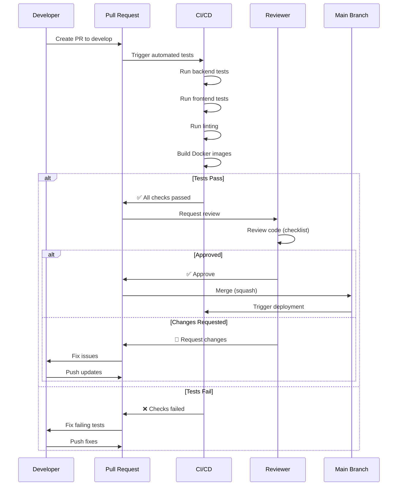

# Git Workflow and CI/CD Strategy

**Version**: 1.0.0
**Date**: 2025-12-27
**Author**: Architecture Planner Agent
**Status**: Ready for Implementation

---

## Executive Summary

This document defines the complete Git workflow, branching strategy, commit conventions, code review process, and CI/CD automation for the Academic Paper Analysis Tool.

**Core Principles**:
- Every commit must pass tests (enforced by pre-commit hooks)
- Every PR must be reviewed (enforced by branch protection)
- Main branch is always deployable
- Automated testing on every push
- Zero tolerance for broken builds

---

## Git Branching Strategy

### Branch Model: Simplified Git Flow

```
main (production-ready)
  ├── develop (integration branch)
  │    ├── feature/openalex-integration
  │    ├── feature/citation-network
  │    ├── feature/search-endpoint
  │    └── feature/force-graph-viz
  └── hotfix/critical-bug-fix
```

---

### Branch Types

#### 1. Main Branch (`main`)

**Purpose**: Production-ready code only
**Protection Rules**:
- Require pull request reviews (1+ approvals)
- Require status checks to pass before merging
- Require branches to be up to date before merging
- Restrict direct pushes (nobody can push directly)
- Require linear history (squash or rebase only)

**Merge Strategy**: Squash and merge (clean history)

**GitHub Branch Protection Settings**:
```yaml
# .github/branch-protection/main.yml
protection:
  required_status_checks:
    strict: true
    contexts:
      - "test-backend"
      - "test-frontend"
      - "lint-backend"
      - "lint-frontend"
      - "build-docker"
  required_pull_request_reviews:
    required_approving_review_count: 1
    dismiss_stale_reviews: true
    require_code_owner_reviews: false
  enforce_admins: false
  restrictions: null
```

---

#### 2. Develop Branch (`develop`)

**Purpose**: Integration branch for features
**Protection Rules**:
- Require pull request reviews (1+ approval)
- Require status checks to pass
- Allow force pushes: No

**Merge Strategy**: Merge commit (preserve feature branch history)

---

#### 3. Feature Branches (`feature/<feature-name>`)

**Naming Convention**:
```
feature/openalex-integration
feature/citation-network-builder
feature/search-endpoint
feature/searchbar-component
feature/force-graph-visualization
```

**Lifecycle**:
1. Branch from `develop`
2. Develop feature with TDD
3. Create PR to `develop`
4. Code review + CI checks
5. Merge to `develop`
6. Delete feature branch

**Creation**:
```bash
# From develop
git checkout develop
git pull origin develop
git checkout -b feature/openalex-integration
```

---

#### 4. Hotfix Branches (`hotfix/<issue-description>`)

**Naming Convention**:
```
hotfix/api-timeout-error
hotfix/graph-crash-on-empty
```

**Lifecycle**:
1. Branch from `main`
2. Fix critical bug
3. Create PR to BOTH `main` AND `develop`
4. Emergency review
5. Merge to both branches
6. Delete hotfix branch

**Creation**:
```bash
# From main
git checkout main
git pull origin main
git checkout -b hotfix/api-timeout-error
```

---

## Commit Message Convention

### Format: Conventional Commits

**Structure**:
```
<type>(<scope>): <subject>

<body>

<footer>
```

**Example**:
```
feat(api): implement OpenAlex client with retry logic

- Add async HTTP client using httpx
- Implement exponential backoff retry (max 3 attempts)
- Add transparent error handling for all API errors
- Test coverage: 87%

Refs: #12
```

---

### Commit Types

| Type | Description | Example |
|------|-------------|---------|
| `feat` | New feature | `feat(search): add /api/search endpoint` |
| `fix` | Bug fix | `fix(graph): correct edge direction in citations` |
| `test` | Add/update tests | `test(client): add integration tests for OpenAlex` |
| `refactor` | Code refactoring | `refactor(network): simplify community detection` |
| `docs` | Documentation | `docs(api): update Swagger examples` |
| `style` | Code style (formatting) | `style(frontend): apply Rams design colors` |
| `perf` | Performance improvement | `perf(graph): optimize layout computation` |
| `chore` | Build/tooling changes | `chore(deps): update FastAPI to 0.109` |
| `ci` | CI/CD changes | `ci(github): add coverage reporting` |

---

### Scope Examples

**Backend**:
- `api` - API routes
- `client` - OpenAlex client
- `network` - Citation network
- `models` - Pydantic models

**Frontend**:
- `search` - SearchBar component
- `graph` - ForceGraph component
- `hooks` - Custom React hooks
- `ui` - UI components

---

### Commit Message Template

**File**: `.gitmessage`

```
# <type>(<scope>): <subject>
# |<----  Using a Maximum Of 50 Characters  ---->|

# Explain why this change is being made
# |<----   Try To Limit Each Line to a Maximum Of 72 Characters   ---->|

# Provide links or keys to any relevant tickets, articles or other resources
# Example: Refs: #23

# --- COMMIT END ---
# Type can be:
#    feat     (new feature)
#    fix      (bug fix)
#    refactor (refactoring code)
#    style    (formatting, missing semicolons, etc)
#    test     (when adding missing tests)
#    docs     (changes to documentation)
#    perf     (performance improvement)
#    chore    (updating build tasks, package manager configs, etc)
#    ci       (CI/CD changes)
# --------------------
# Remember to:
#    - Capitalize the subject line
#    - Use the imperative mood in the subject line
#    - Do not end the subject line with a period
#    - Separate subject from body with a blank line
#    - Use the body to explain what and why vs. how
#    - Can use multiple lines with "-" for bullet points in body
# --------------------
```

**Setup**:
```bash
git config commit.template .gitmessage
```

---

## Code Review Process

### Pull Request Template

**File**: `.github/pull_request_template.md`

```markdown
## Description
<!-- Brief description of changes -->

## Type of Change
- [ ] New feature (feat)
- [ ] Bug fix (fix)
- [ ] Refactoring (refactor)
- [ ] Documentation (docs)
- [ ] Tests (test)
- [ ] Performance improvement (perf)

## Checklist

### Code Quality
- [ ] Code follows project conventions (DRY, KISS)
- [ ] All errors are transparent (no silent failures)
- [ ] Code passes linting (black, isort, mypy for backend; eslint for frontend)
- [ ] No hardcoded secrets or API keys

### Testing
- [ ] Tests written BEFORE implementation (TDD)
- [ ] All new tests pass
- [ ] Test coverage ≥ 80% for new code
- [ ] Integration tests updated (if applicable)

### Documentation
- [ ] Code has docstrings/comments
- [ ] API documentation updated (if applicable)
- [ ] README updated (if applicable)

### Design (Frontend Only)
- [ ] Follows Rams design principles
- [ ] Colors: Only white/gray/orange
- [ ] No gradients or shadows
- [ ] Layout is clean and grid-based

### Performance
- [ ] No performance regressions
- [ ] Meets performance targets (if applicable)

## Test Coverage
<!-- Paste coverage report -->
```
Backend:
- File: XX%
- Overall: XX%

Frontend:
- File: XX%
- Overall: XX%
```

## Screenshots (Frontend Only)
<!-- Add screenshots demonstrating Rams design compliance -->

## Related Issues
<!-- Link to related issues -->
Closes #
Refs #

## Reviewer Notes
<!-- Any specific areas to focus on during review -->
```

---

### Review Checklist for Reviewers

**File**: `.claude/docs/reviews/pr-review-checklist.md`

```markdown
# PR Review Checklist

## 1. Code Quality (DRY, KISS) ✅ / ❌

- [ ] No duplicate code
- [ ] Simplest viable solution
- [ ] Clear, maintainable patterns
- [ ] Appropriate abstractions

**Notes**:

---

## 2. Transparent Error Handling ✅ / ❌

- [ ] No `except: pass` or silent failures
- [ ] All errors include context
- [ ] Error messages are actionable
- [ ] Users can understand what went wrong

**Notes**:

---

## 3. TDD Compliance ✅ / ❌

- [ ] Tests exist for new features
- [ ] Tests written before implementation (verify git history if unclear)
- [ ] Test coverage ≥ 80%
- [ ] Tests are comprehensive (edge cases, errors)

**Coverage Report**:
```
[Paste coverage]
```

**Notes**:

---

## 4. Design Compliance (Frontend Only) ✅ / ❌

- [ ] Rams principles followed
- [ ] Colors: White/Gray/Orange only
- [ ] No gradients
- [ ] No shadows
- [ ] Clean grid layout

**Screenshot Review**:
[Attach screenshots]

**Notes**:

---

## 5. Documentation ✅ / ❌

- [ ] Functions have docstrings
- [ ] Complex logic has comments
- [ ] API docs updated (if applicable)

**Notes**:

---

## 6. Performance ✅ / ❌

- [ ] No obvious performance issues
- [ ] Meets performance targets (if applicable)
- [ ] No memory leaks (frontend)

**Notes**:

---

## 7. Security ✅ / ❌

- [ ] No hardcoded secrets
- [ ] No SQL injection risks
- [ ] No XSS vulnerabilities (frontend)

**Notes**:

---

## Decision

- [ ] **✅ APPROVE** - Ready to merge
- [ ] **💬 COMMENT** - Suggestions for improvement (non-blocking)
- [ ] **🔄 REQUEST CHANGES** - Must fix before merging
- [ ] **❌ REJECT** - Significant issues

**Summary**:

**Action Items** (if requesting changes):
1.
2.
3.
```

---

### Review Flow



---

## Pre-commit Hooks

**Purpose**: Enforce code quality BEFORE commit

**File**: `.pre-commit-config.yaml`

```yaml
# Pre-commit hooks for code quality
# Install: pip install pre-commit
# Setup: pre-commit install

repos:
  # Backend: Python
  - repo: https://github.com/psf/black
    rev: 24.1.1
    hooks:
      - id: black
        files: ^backend/
        exclude: ^backend/tests/

  - repo: https://github.com/PyCQA/isort
    rev: 5.13.2
    hooks:
      - id: isort
        files: ^backend/
        args: ["--profile", "black"]

  - repo: https://github.com/pre-commit/mirrors-mypy
    rev: v1.8.0
    hooks:
      - id: mypy
        files: ^backend/app/
        additional_dependencies: [types-all]

  # Frontend: TypeScript/JavaScript
  - repo: https://github.com/pre-commit/mirrors-eslint
    rev: v8.56.0
    hooks:
      - id: eslint
        files: ^frontend/src/
        types: [file]
        types_or: [javascript, jsx, ts, tsx]

  # General: Formatting
  - repo: https://github.com/pre-commit/pre-commit-hooks
    rev: v4.5.0
    hooks:
      - id: trailing-whitespace
      - id: end-of-file-fixer
      - id: check-yaml
      - id: check-json
      - id: check-added-large-files
        args: ['--maxkb=500']

  # Backend: Testing (critical)
  - repo: local
    hooks:
      - id: pytest-backend
        name: Run backend tests
        entry: bash -c 'cd backend && pytest tests/ -v --cov=app --cov-fail-under=80'
        language: system
        pass_filenames: false
        always_run: true
        stages: [commit]

  # Frontend: Testing (critical)
  - repo: local
    hooks:
      - id: jest-frontend
        name: Run frontend tests
        entry: bash -c 'cd frontend && npm test -- --coverage --coverageThreshold={"global":{"branches":80,"functions":80,"lines":80,"statements":80}}'
        language: system
        pass_filenames: false
        always_run: true
        stages: [commit]
```

**Installation**:
```bash
# Install pre-commit
pip install pre-commit

# Install hooks
pre-commit install

# Run manually on all files
pre-commit run --all-files
```

**Bypass** (for emergencies only):
```bash
git commit --no-verify -m "emergency fix"
```

---

## CI/CD Pipeline (GitHub Actions)

### Workflow 1: Backend Testing

**File**: `.github/workflows/backend-tests.yml`

```yaml
name: Backend Tests

on:
  push:
    branches: [ main, develop ]
    paths:
      - 'backend/**'
      - '.github/workflows/backend-tests.yml'
  pull_request:
    branches: [ main, develop ]
    paths:
      - 'backend/**'

jobs:
  test:
    runs-on: ubuntu-latest
    strategy:
      matrix:
        python-version: ["3.10", "3.11"]

    steps:
    - uses: actions/checkout@v4

    - name: Set up Python ${{ matrix.python-version }}
      uses: actions/setup-python@v5
      with:
        python-version: ${{ matrix.python-version }}

    - name: Cache pip dependencies
      uses: actions/cache@v4
      with:
        path: ~/.cache/pip
        key: ${{ runner.os }}-pip-${{ hashFiles('backend/requirements.txt') }}
        restore-keys: |
          ${{ runner.os }}-pip-

    - name: Install dependencies
      run: |
        cd backend
        pip install -r requirements.txt

    - name: Lint with black
      run: |
        cd backend
        black --check app/ tests/

    - name: Sort imports with isort
      run: |
        cd backend
        isort --check app/ tests/

    - name: Type check with mypy
      run: |
        cd backend
        mypy app/

    - name: Run tests with coverage
      run: |
        cd backend
        pytest tests/ -v --cov=app --cov-report=xml --cov-report=term-missing --cov-fail-under=80

    - name: Upload coverage to Codecov
      uses: codecov/codecov-action@v4
      with:
        file: ./backend/coverage.xml
        flags: backend
        name: backend-coverage

    - name: Performance tests
      if: github.event_name == 'pull_request'
      run: |
        cd backend
        pytest tests/ -m slow -v
```

---

### Workflow 2: Frontend Testing

**File**: `.github/workflows/frontend-tests.yml`

```yaml
name: Frontend Tests

on:
  push:
    branches: [ main, develop ]
    paths:
      - 'frontend/**'
      - '.github/workflows/frontend-tests.yml'
  pull_request:
    branches: [ main, develop ]
    paths:
      - 'frontend/**'

jobs:
  test:
    runs-on: ubuntu-latest
    strategy:
      matrix:
        node-version: [18.x, 20.x]

    steps:
    - uses: actions/checkout@v4

    - name: Setup Node.js ${{ matrix.node-version }}
      uses: actions/setup-node@v4
      with:
        node-version: ${{ matrix.node-version }}
        cache: 'npm'
        cache-dependency-path: frontend/package-lock.json

    - name: Install dependencies
      run: |
        cd frontend
        npm ci

    - name: Lint
      run: |
        cd frontend
        npm run lint

    - name: Type check
      run: |
        cd frontend
        npx tsc --noEmit

    - name: Run tests with coverage
      run: |
        cd frontend
        npm test -- --coverage --coverageThreshold='{"global":{"branches":80,"functions":80,"lines":80,"statements":80}}'

    - name: Upload coverage to Codecov
      uses: codecov/codecov-action@v4
      with:
        file: ./frontend/coverage/coverage-final.json
        flags: frontend
        name: frontend-coverage

    - name: Build
      run: |
        cd frontend
        npm run build
```

---

### Workflow 3: Docker Build

**File**: `.github/workflows/docker-build.yml`

```yaml
name: Docker Build

on:
  push:
    branches: [ main, develop ]
  pull_request:
    branches: [ main, develop ]

jobs:
  build-backend:
    runs-on: ubuntu-latest
    steps:
    - uses: actions/checkout@v4

    - name: Set up Docker Buildx
      uses: docker/setup-buildx-action@v3

    - name: Build backend image
      uses: docker/build-push-action@v5
      with:
        context: ./backend
        push: false
        tags: paper-analysis-backend:test
        cache-from: type=gha
        cache-to: type=gha,mode=max

  build-frontend:
    runs-on: ubuntu-latest
    steps:
    - uses: actions/checkout@v4

    - name: Set up Docker Buildx
      uses: docker/setup-buildx-action@v3

    - name: Build frontend image
      uses: docker/build-push-action@v5
      with:
        context: ./frontend
        push: false
        tags: paper-analysis-frontend:test
        cache-from: type=gha
        cache-to: type=gha,mode=max
```

---

### Workflow 4: Integration Tests

**File**: `.github/workflows/integration-tests.yml`

```yaml
name: Integration Tests

on:
  pull_request:
    branches: [ main, develop ]

jobs:
  integration:
    runs-on: ubuntu-latest
    steps:
    - uses: actions/checkout@v4

    - name: Start services with Docker Compose
      run: |
        docker-compose up -d
        sleep 30  # Wait for services to be ready

    - name: Run backend integration tests
      run: |
        docker-compose exec -T backend pytest tests/ -m integration -v

    - name: Test backend health
      run: |
        curl -f http://localhost:8000/api/health || exit 1

    - name: Test frontend accessibility
      run: |
        curl -f http://localhost:3000 || exit 1

    - name: Test search endpoint
      run: |
        response=$(curl -s http://localhost:8000/api/search?query=test&limit=5)
        echo $response | jq -e '.metadata.total_nodes >= 0'

    - name: Cleanup
      if: always()
      run: |
        docker-compose logs
        docker-compose down -v
```

---

### Workflow 5: Deployment (Production)

**File**: `.github/workflows/deploy-production.yml`

```yaml
name: Deploy to Production

on:
  push:
    branches: [ main ]
    tags:
      - 'v*.*.*'

jobs:
  deploy:
    runs-on: ubuntu-latest
    if: github.ref == 'refs/heads/main'

    steps:
    - uses: actions/checkout@v4

    - name: Set up Docker Buildx
      uses: docker/setup-buildx-action@v3

    - name: Login to Docker Hub
      uses: docker/login-action@v3
      with:
        username: ${{ secrets.DOCKER_USERNAME }}
        password: ${{ secrets.DOCKER_PASSWORD }}

    - name: Build and push backend
      uses: docker/build-push-action@v5
      with:
        context: ./backend
        push: true
        tags: |
          yourusername/paper-analysis-backend:latest
          yourusername/paper-analysis-backend:${{ github.sha }}

    - name: Build and push frontend
      uses: docker/build-push-action@v5
      with:
        context: ./frontend
        push: true
        tags: |
          yourusername/paper-analysis-frontend:latest
          yourusername/paper-analysis-frontend:${{ github.sha }}

    - name: Deploy to production
      run: |
        # Add deployment steps here (e.g., SSH to server, docker-compose pull, restart)
        echo "Deployment steps would go here"
```

---

## Testing Strategy

### Test Pyramid

```
         /\
        /  \  E2E Tests (5%)
       /----\
      /      \  Integration Tests (15%)
     /--------\
    /          \  Unit Tests (80%)
   /------------\
```

### Coverage Enforcement

**Backend**:
- Minimum: 80%
- Target: 85%+
- Enforced: pytest --cov-fail-under=80

**Frontend**:
- Minimum: 80%
- Target: 80%+
- Enforced: jest --coverageThreshold

### Test Execution Matrix

| Test Type | When | Where | Required |
|-----------|------|-------|----------|
| Unit tests (backend) | Every commit | Pre-commit hook | ✅ Yes |
| Unit tests (frontend) | Every commit | Pre-commit hook | ✅ Yes |
| Linting | Every commit | Pre-commit hook | ✅ Yes |
| Integration tests | Every PR | GitHub Actions | ✅ Yes |
| E2E tests | Every PR to main | GitHub Actions | ✅ Yes |
| Performance tests | Weekly | Manual / Scheduled | ⚠️ Recommended |

---

## Deployment Strategy

### Environment Setup

**1. Development** (`develop` branch)
- Auto-deploy on merge to develop
- URL: dev.paperanalysis.com
- Database: Development DB
- Monitoring: Basic logging

**2. Staging** (`release/*` branches)
- Manual deployment
- URL: staging.paperanalysis.com
- Database: Staging DB (production snapshot)
- Monitoring: Full monitoring

**3. Production** (`main` branch)
- Manual approval required
- URL: paperanalysis.com
- Database: Production DB
- Monitoring: Full monitoring + alerting

---

### Deployment Checklist

**File**: `.claude/docs/deployment/deployment-checklist.md`

```markdown
# Deployment Checklist

## Pre-Deployment

- [ ] All tests pass on main branch
- [ ] Code review approved
- [ ] Test coverage ≥ 80%
- [ ] Performance benchmarks met
- [ ] Security scan passed
- [ ] Database migrations tested
- [ ] Changelog updated
- [ ] Documentation updated

## Deployment Steps

1. [ ] Tag release: `git tag -a v1.0.0 -m "Release v1.0.0"`
2. [ ] Push tag: `git push origin v1.0.0`
3. [ ] Monitor CI/CD pipeline
4. [ ] Verify Docker images built
5. [ ] Backup production database
6. [ ] Deploy to production
7. [ ] Run smoke tests
8. [ ] Monitor error rates
9. [ ] Update status page

## Post-Deployment

- [ ] Verify all services healthy
- [ ] Check logs for errors
- [ ] Monitor performance metrics
- [ ] Test critical user flows
- [ ] Notify team of deployment

## Rollback Plan

If deployment fails:
1. Revert to previous Docker images
2. Restore database backup (if needed)
3. Restart services
4. Investigate issues
5. Create hotfix branch if needed
```

---

## Success Metrics

### Code Quality Metrics

| Metric | Target | Enforcement |
|--------|--------|-------------|
| Test Coverage (Backend) | ≥ 80% | pytest --cov-fail-under=80 |
| Test Coverage (Frontend) | ≥ 80% | jest --coverageThreshold |
| Linting Errors | 0 | black, isort, eslint |
| Type Errors | 0 | mypy, tsc |
| DRY Violations | 0 | Manual code review |
| Silent Failures | 0 | Manual code review |

### CI/CD Metrics

| Metric | Target |
|--------|--------|
| Build Time (Backend) | < 5 minutes |
| Build Time (Frontend) | < 8 minutes |
| Test Execution Time | < 3 minutes |
| Deployment Time | < 10 minutes |
| Failed Build Rate | < 5% |

### Review Metrics

| Metric | Target |
|--------|--------|
| Time to First Review | < 24 hours |
| Time to Merge | < 48 hours |
| PR Size | < 400 lines |
| Review Iterations | < 3 |

---

## Document Metadata

**Version**: 1.0.0
**Last Updated**: 2025-12-27
**Author**: Architecture Planner Agent
**Status**: ✅ Ready for Implementation

---

**End of Git Workflow and CI/CD Strategy**
