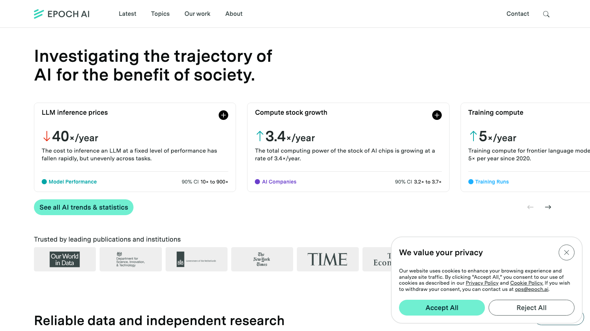
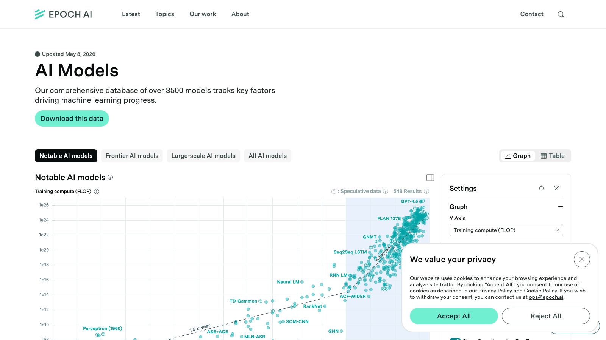
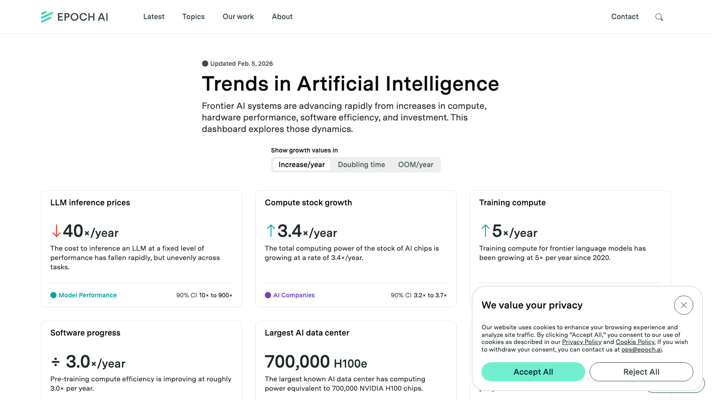
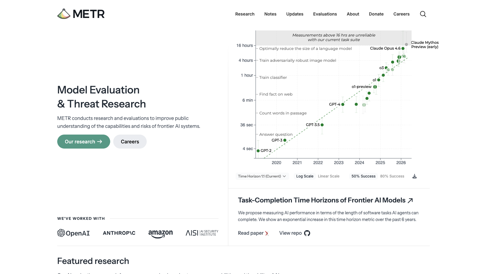
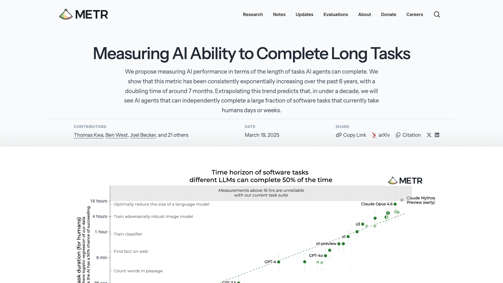

# 竞品研究：Epoch AI & METR

> 对标 Angela 提到的"EEMTR"— 实际为 Epoch AI + METR 两个组织

---

## 1. Epoch AI（epoch.ai）

### 定位

数据驱动的 AI 发展趋势研究非营利组织。核心产品是"AI 发展量化追踪"。

### 核心产品页面

#### 1.1 首页 — Metric Cards

**设计要点：**
- 大号粗体数字传达核心洞察：`↓40×/year`、`↑3.4×/year`、`↑5×/year`
- 每张卡片 = 一个 trend + 一句话解释 + 90% 置信区间
- 白底极简，无装饰元素，数据即主角
- 可横向滑动浏览更多指标

**对我们的启示：**
- Era header 可加类似 headline metric（如"World Model 论文产出 2022→2025: 12×"）
- 置信区间的概念可映射到我们的连线确定性（solid vs dashed）

#### 1.2 Notable AI Models — 可配置散点图

**设计要点：**
- 3500+ 模型数据库，用户可切换 X/Y 轴（时间、FLOP、参数量、成本）
- 颜色统一（不编码额外维度），避免信息过载
- 支持 Graph / Table 视图切换
- 右侧 Settings 面板控制轴映射
- 标注标记 Speculative data 置信度
- 支持下载原始数据

**对我们的启示：**
- 轴切换模式 = 同一拓扑多种投影。我们未来可做"按时间/按 citation/按算力"切换
- Graph/Table 双视图对投资人很友好（有人喜欢图，有人要 Excel）

#### 1.3 Trends Dashboard

**设计要点：**
- Dashboard 布局：多指标并列，每个指标独立卡片
- 增长率可切换表示：Multiplier/year、Doubling time、OOM/year
- 数据源标注清晰（Model Performance / AI Companies / Training Runs）

**对我们的启示：**
- 同一趋势的多种表述方式（倍率 vs 翻倍时间）适配不同受众
- 投资人看倍率，研究者看 OOM

---

## 2. METR（metr.org）

### 定位

Model Evaluation & Threat Research。做前沿模型能力评估，用"任务可完成时长"作为统一度量。

### 核心产品页面

#### 2.1 首页 — 单图叙事

**设计要点：**
- 首页右侧放一张核心图：Task-Completion Time Horizons
- Y 轴 = 任务时长（log scale: 4sec → 16hrs），X 轴 = 时间（2020-2026）
- 每个数据点 = 一个模型（GPT-2 → GPT-3 → GPT-4 → o1 → Claude Opus）
- 指数增长一目了然：~7个月翻倍
- 灰色虚线标注"超过16小时不可靠"的边界

**对我们的启示：**
- "一张图讲一个故事"的极致做法
- Arena View 可借鉴：用一条前沿线展示"范式能力边界随时间推移"
- 模型标注在数据点旁 → 我们的节点标注 Player+Year 也是类似逻辑

#### 2.2 论文详情页

**设计要点：**
- 标题即结论："Measuring AI Ability to Complete Long Tasks"
- 副标题给 key finding："doubling time of around 7 months"
- 同一张图更大、更详细，支持 Log/Linear Scale 切换、50%/80% Success 切换
- 作者、日期、引用格式、代码仓库链接一应俱全

**对我们的启示：**
- 论文 Panel 的信息架构参考：标题 → 核心发现 → 详细图表 → 元数据

---

## 3. 对比总结

| 维度 | Epoch AI | METR | 我们（World Model Map） |
|------|----------|------|------------------------|
| 核心问题 | How fast / how much | How capable | Why（因果 + 哲学谱系） |
| 可视化类型 | 散点图 + trend lines | 单指数曲线 | 地铁图 + 拓扑网络 |
| 数据规模 | 3500+ 模型 | ~20 评估点 | 83 篇论文（持续扩充） |
| 颜色编码 | 组织/国家/领域 | 模型系列 | 赛道（6色） |
| 交互 | 轴切换、筛选、下载 | Log/Linear、Success% | Player 筛选、Iteration 展开 |
| 受众 | 政策制定者、研究者 | AI Safety 社区 | 投资人 + 研究者 |
| 叙事方式 | 量化趋势 + 置信度 | 单指标指数增长 | 因果链 + 范式竞争 |

---

## 4. 我们的差异化价值

**它们不做、但我们做的：**

1. **因果拓扑** — 不只展示"谁更强/更快"，而是"为什么 A 出现在 B 之后"
2. **范式竞争** — 同一问题的不同技术哲学如何分叉、如何收敛
3. **收敛信号** — 通过 iteration 深度和后续引用模式判断路线成熟度
4. **赛道×范式交叉** — 颜色=市场赛道 + 位置=技术范式，一眼看出技术-市场映射

**它们做得好、我们应借鉴的：**

| 借鉴点 | 来源 | 落地方式 | 优先级 |
|--------|------|---------|--------|
| Bold Metric Card | Epoch 首页 | Era header 加大号趋势数字 | P2 |
| 置信度标注 | Epoch Notable Models | 连线实线/虚线已有，可加 tooltip | P3 |
| 单图叙事 | METR 首页 | Arena View 用前沿线做类似呈现 | P2 |
| Graph/Table 切换 | Epoch | 加论文列表视图 | P2 |
| 数据可下载 | Epoch | 导出 JSON/CSV | P3 |
| Log/Linear Scale | METR | 时间轴缩放 | P3 |

---

## 5. 设计语言对比

| 元素 | Epoch AI | METR | 我们 |
|------|----------|------|------|
| 背景 | 白 #FFFFFF | 白 #FFFFFF | 白 #FFFFFF |
| 主色 | 青绿 ~#2DD4BF | 深绿 ~#1A7F37 | 多色编码（赛道6色） |
| 字体 | Sans-serif（细体标题） | Sans-serif | IBM Plex Sans |
| 数据密度 | 高（dashboard） | 低（单图） | 中（地铁图） |
| 装饰 | 零 | 零 | 零（Rams 原则） |
| 边框 | 轻灰 1px 卡片 | 几乎无 | 1px #E4E4E7 |

**共同点：都遵循"数据即界面"原则，无装饰性元素。** 这与我们的 Rams 设计原则完全一致。

---

## 6. 结论

Angela 提到的对标对象确认为 **Epoch AI**（"EEMTR"可能是口误/简称混淆）。

核心差异：Epoch/METR 回答 **"多快/多强"**，我们回答 **"为什么/怎么来的"**。这是互补而非竞争关系。我们可以借鉴它们的量化呈现手法（metric cards、趋势数字），增强我们因果叙事的说服力。
