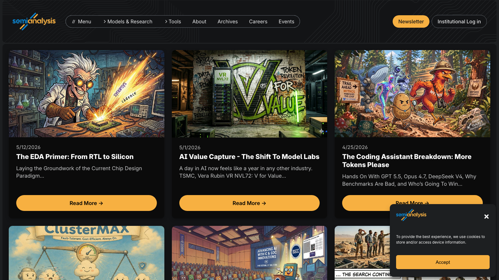
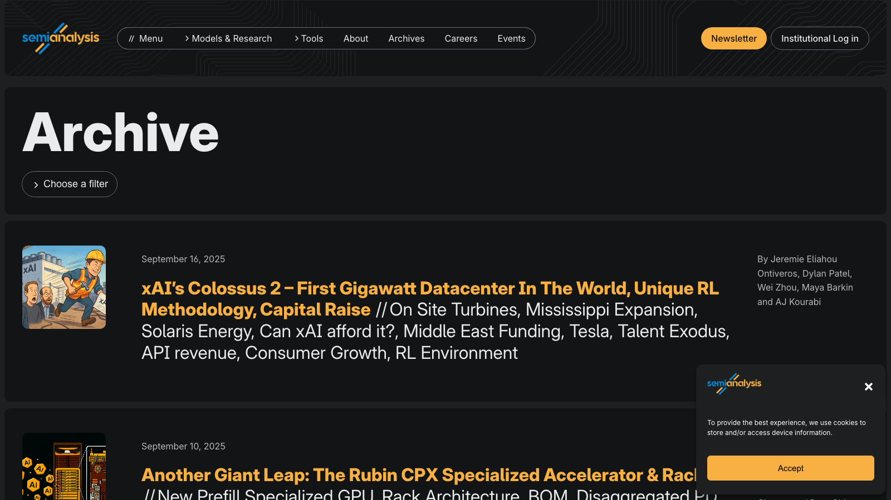

# 竞品研究：SemiAnalysis

> Angela 对标："deliver 的东西…不能太纯技术…比科普还要在技术深一些，升维一点，对标 SemiAnalysis"

---

## 1. 是什么

SemiAnalysis 是一家面向机构投资者的半导体 & AI 基础设施研究公司。定位在华尔街卖方研报和学术论文之间——技术上足够深，但始终服务于决策者（投资人、高管、采购负责人）。

- 20万+ 免费订阅者（Newsletter）
- 付费层：机构级 Advisory、定制研究、数据工具（GPU 定价指数、AI Cloud TCO 模型、Inference Simulator）
- 被 NYT、Bloomberg、Economist 等引用

---

## 2. 首页 & Archive

### 首页

**设计要点：**
- 深色背景 + 橙色强调色，视觉上"重量感"强
- 卡片式文章列表，每篇配插画（风格化、非照片）
- 标题即论点："The EDA Primer: From RTL to Silicon"、"AI Value Capture - The Shift To Model Labs"
- 副标题给 context + 关键词密集
- 导航：Models & Research / Tools / Archives / Events

### Archive

**设计要点：**
- 长列表，按时间倒序
- 每篇标题都是 declarative statement（不是问句，是判断）
- 标注作者（多人协作）
- 文章极长（3000-8000+ 字），信息密度高

---

## 3. 内容模型分析

### 3.1 每篇文章的结构

| 层次 | 内容 | 作用 |
|------|------|------|
| 标题 | Sharp 判断/预测 | 吸引 + 表明立场 |
| 副标题 | 关键词列表/Context | 快速判断是否相关 |
| 开篇 | Thesis（1-2段） | 回答"So what?" |
| 正文 | 技术证据 + 成本模型 + 竞品对比 | 支撑 thesis |
| 结尾 | Forward-looking implications | 回答"Then what?" |

### 3.2 核心方法论

1. **Opinionated thesis first** — 不是"这里有个技术"，而是"这个技术意味着 X 会赢/输"
2. **Quantitative anchoring** — 成本、benchmark、参数量、功耗作为论据骨架
3. **Competitive framing** — 永远是 A vs B，谁赢为什么赢
4. **Supply chain evidence** — die shot、工艺节点、良率数据（我们对应：citation 数据、团队背景）
5. **Decision-maker language** — implications before details

### 3.3 产品矩阵

| 产品 | 形式 | 价值 |
|------|------|------|
| Newsletter（免费） | 标题 + 前几段 | 获客漏斗 |
| Deep Dive（付费） | 完整分析 | 核心产品 |
| GPU Pricing Index | 实时数据工具 | 持续决策支持 |
| AI Cloud TCO Model | 交互计算器 | 投资建模 |
| Inference Simulator | 模拟工具 | 技术评估 |
| Advisory | 咨询服务 | 高端变现 |

---

## 4. 与我们的对照

### 4.1 Angela 的期望映射

| Angela 原话 | SemiAnalysis 做法 | 我们应该做的 |
|------------|------------------|-------------|
| "比科普深一些，升维一点" | 技术深度 > 科普，但用决策者语言包装 | 图谱是底层，上层输出有观点的分析 |
| "有 sharp 观点 + evidence" | 每篇开篇就亮观点，正文全是证据 | 每个赛道/范式要有"我们认为 X 会赢"的判断 |
| "不是纯技术" | 技术服务于商业判断 | 连接技术演进 → 投资含义 |
| "对标 SEMI Analysis" | 芯片领域的技术投资视角 | 我们 = World Model 领域的技术投资视角 |

### 4.2 差异化定位

| 维度 | SemiAnalysis | 我们 |
|------|-------------|------|
| 领域 | 半导体 & AI 基础设施 | World Model / AI 范式演进 |
| 信息源 | 供应链数据、die shot、成本模型 | 论文 citation、团队 mapping、融资数据 |
| 核心 deliverable | 长文 deep dive | 交互式图谱 + 配套分析 |
| 时间维度 | 当下 + 未来 6-12月预测 | 历史演进 + 趋势收敛信号 |
| 受众 | 买方/卖方分析师 | 投资人 + 内部研究团队 |

### 4.3 我们比 SemiAnalysis 多的

- **可视化图谱** — 它们纯文字+图表，我们有交互式地铁图
- **因果拓扑** — 它们逐篇分析，我们展示技术之间的因果链
- **收敛信号** — 它们靠人判断，我们用 iteration 深度 + citation 模式量化

### 4.4 我们应该学的

- **文字输出要有 thesis** — 图谱旁边需要配"我们认为"的文字判断
- **Competitive framing** — Arena View 直接对应它们的 "X vs Y" 分析
- **数据工具化** — 图谱本身就是工具，可以考虑加 filtering/export

---

## 5. Actionable 建议

| # | 建议 | 对应我们的落地 | 优先级 |
|---|------|--------------|--------|
| 1 | 每个赛道写一段 thesis（200字判断） | 图谱侧边栏或独立文档 | P1 |
| 2 | 竞争对比 framing | Arena View 设计 | P1 |
| 3 | 量化锚点 | 论文数 / citation 增速 / 融资额作为 evidence | P1 |
| 4 | Forward-looking | 每个 Lane 末尾加"下一步会怎样"预测 | P2 |
| 5 | 分层深度 | 全局图谱（概览）→ 点击展开（deep dive）| P2 |
| 6 | 定期更新节奏 | 图谱每两周刷新一次 | P2 |

---

## 6. 结论

SemiAnalysis 的成功公式 = **Sharp opinion × Deep evidence × Decision-maker packaging**

我们要做 World Model 领域的"SemiAnalysis"，区别在于：
- 它们的 evidence 是供应链数据 → 我们的 evidence 是论文谱系 + 团队 mapping + 融资数据
- 它们的呈现是长文 → 我们的呈现是交互图谱 + 配套观点
- 核心相同：**每个输出都回答"我该 bet on 什么？"而不只是"有什么存在？"**
