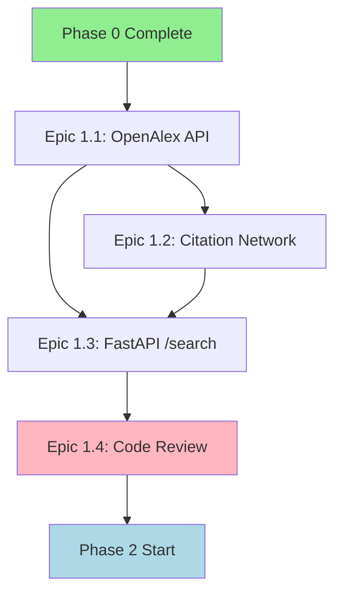
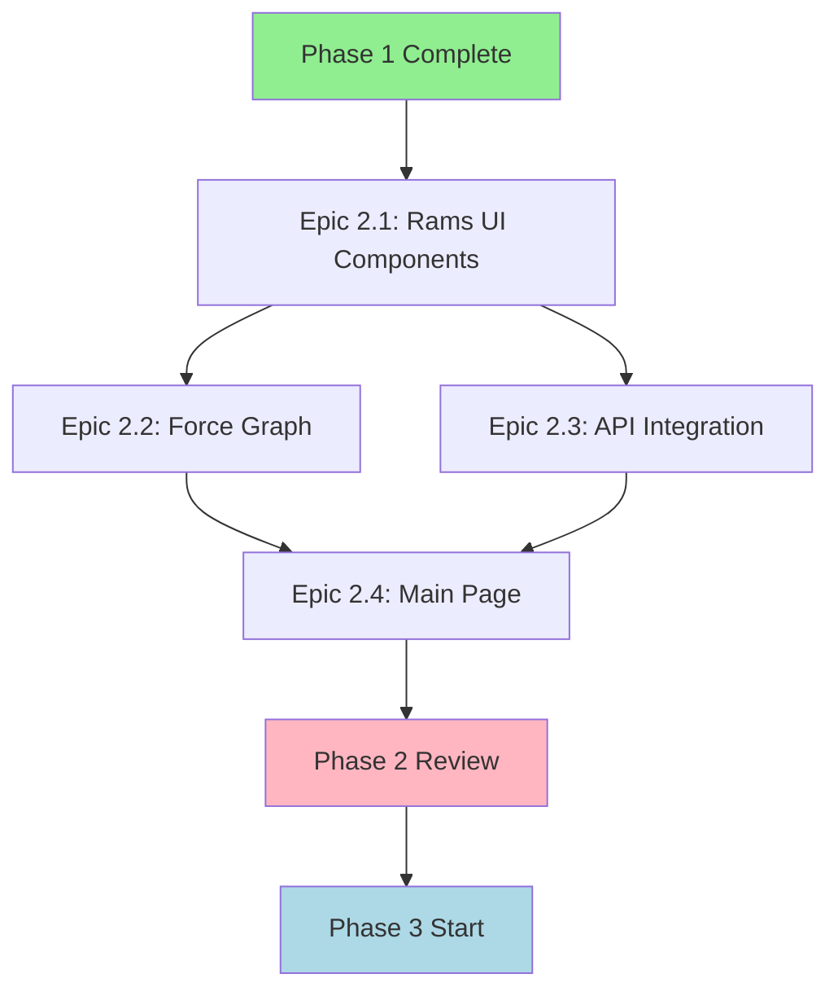
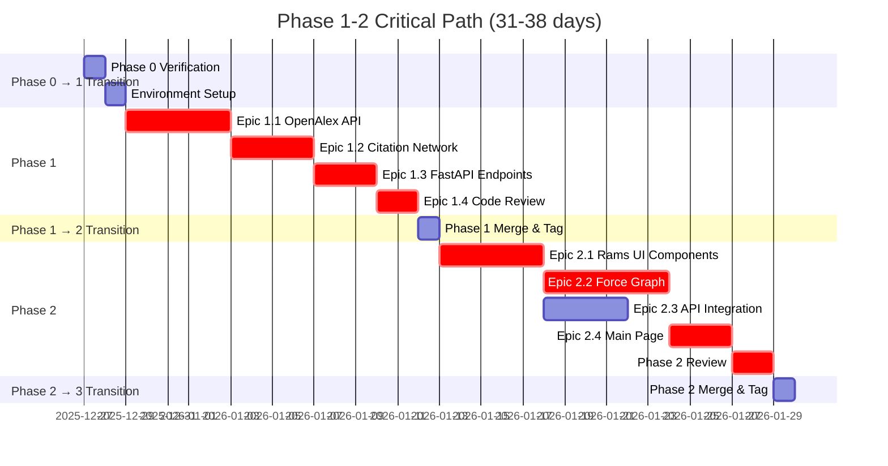
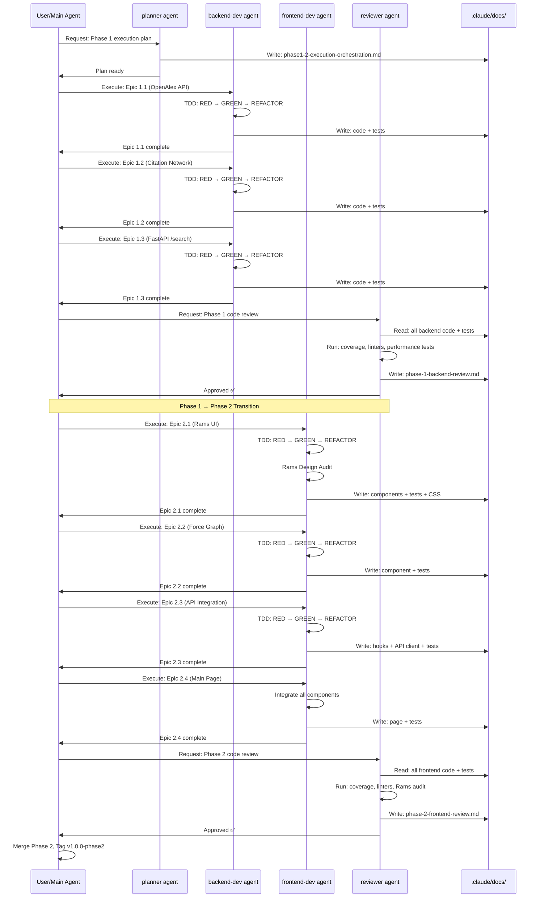
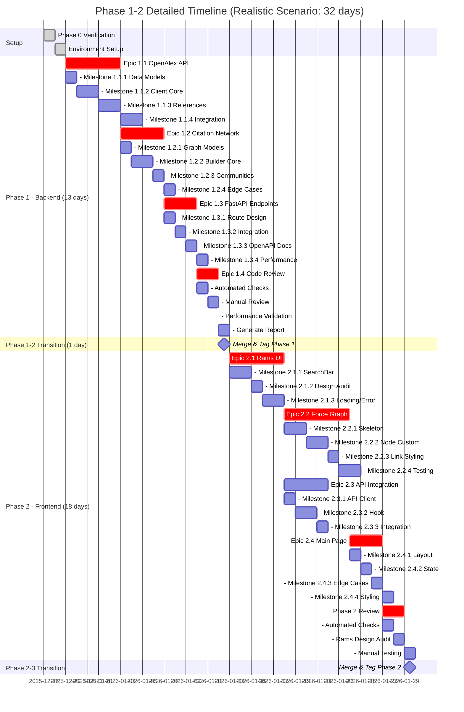

# Phase 1-2 Execution Orchestration Plan

**Version**: 1.0.0
**Date**: 2025-12-27
**Author**: Architecture Planner Agent
**Status**: Ready for Execution
**Target Audience**: backend-dev, frontend-dev, reviewer agents

---

## Executive Summary

This document orchestrates the execution of Phase 1 (Core Backend Development) and Phase 2 (Frontend Visualization) for the Academic Paper Analysis Tool. It builds upon the detailed implementation guides and provides a comprehensive project management framework to ensure smooth transitions, parallel execution where possible, and strict quality control.

**Phase Scope**:
- **Phase 1**: 4 Epics, 2-3 weeks, Backend (FastAPI, NetworkX, OpenAlex API)
- **Phase 2**: 4 Epics, 2-3 weeks, Frontend (Next.js, React, react-force-graph-2d, Rams Design)

**Critical Constraints**:
- Test-Driven Development (TDD): Mandatory Red → Green → Refactor
- DRY Principle: Zero code duplication tolerance
- KISS Principle: Simplest viable implementation
- Transparent Error Handling: Zero silent failures
- Dieter Rams Design (Frontend): Strict adherence to 10 principles

**Success Criteria**:
- Backend Test Coverage ≥ 85%
- Frontend Test Coverage ≥ 80%
- All Performance Targets Met
- Zero DRY/KISS/Rams Violations
- Reviewer Approval Obtained

---

## 1. Phase 0 → Phase 1 Transition Strategy

### 1.1 Phase 0 Completion Verification Checklist

Before starting Phase 1, verify Phase 0 is complete:

```bash
# Backend Verification
cd backend
pytest tests/ -v --cov=app --cov-report=term-missing
# Expected: All tests pass, coverage ≥ 80%

# Frontend Verification
cd ../frontend
npm test -- --coverage
# Expected: All tests pass (7/7), coverage ≥ 80%

# Docker Verification
cd ..
docker-compose up -d
curl http://localhost:8000/api/health
# Expected: {"status":"ok","version":"1.0.0"}

curl http://localhost:3000/api/health
# Expected: {"status":"ok"}

docker-compose down
```

**Phase 0 Acceptance Gates**:
- [ ] Backend `/api/health` endpoint responds 200
- [ ] Frontend health check responds 200
- [ ] All backend tests pass with coverage ≥ 80%
- [ ] All frontend tests pass (7/7)
- [ ] Docker Compose starts all services without errors
- [ ] No DRY violations (verified by reviewer)
- [ ] No KISS violations (verified by reviewer)
- [ ] No silent failures (verified by reviewer)
- [ ] Rams design compliance (frontend colors, no gradients/shadows)

**If Phase 0 Incomplete**:
1. Do NOT start Phase 1
2. Return to `immediate-execution-plan.md`
3. Complete pending tasks (T1-T5)
4. Obtain reviewer approval

### 1.2 Environment Preparation for Phase 1

**Backend Dependencies Additions** (add to `backend/requirements.txt`):
```txt
# Existing (from Phase 0)
fastapi==0.104.1
uvicorn[standard]==0.24.0
pydantic==2.5.2
pytest==7.4.3
pytest-cov==4.1.0
httpx==0.25.2

# Phase 1 Additions
networkx==3.2.1           # Citation network analysis
pytest-asyncio==0.21.1    # Async test support
python-dotenv==1.0.0      # Environment configuration
```

**Installation**:
```bash
cd backend
pip install -r requirements.txt
```

**Environment Variables** (create `backend/.env`):
```env
# OpenAlex API (optional, but recommended for polite pool)
OPENALEX_EMAIL=your-email@example.com

# FastAPI Settings
APP_NAME=Academic Paper Analysis API
APP_VERSION=1.0.0
DEBUG=true

# CORS (for frontend communication)
ALLOWED_ORIGINS=http://localhost:3000,http://frontend:3000
```

**Frontend Dependencies Additions** (add to `frontend/package.json`):
```json
{
  "dependencies": {
    "react-force-graph-2d": "^1.25.4"
  }
}
```

**Installation**:
```bash
cd frontend
npm install
```

### 1.3 Git Workflow Activation

**Branch Strategy** (from `git-workflow-and-cicd.md`):
```bash
# Ensure you are on develop branch
git checkout develop

# Create feature branch for Phase 1
git checkout -b feature/phase1-backend-core

# For parallel Phase 2 work (later)
# git checkout develop
# git checkout -b feature/phase2-frontend-ui
```

**Pre-commit Hooks Setup**:
```bash
# Install pre-commit tool
pip install pre-commit

# Install hooks
pre-commit install

# Test hooks
pre-commit run --all-files
```

**Commit Message Template** (`.gitmessage`):
```
<type>(<scope>): <subject>

<body>

<footer>

# Types: feat, fix, test, refactor, docs, style, perf, chore, ci
# Scopes: api, client, network, search, graph, ui, test, docs
# Example: feat(client): add OpenAlex API retry logic with exponential backoff
```

### 1.4 Phase 0 → Phase 1 Smooth Transition Steps

**Step 1: Documentation Handoff** (10 minutes)
```bash
# Ensure all Phase 0 docs are finalized
ls -lh .claude/docs/specs/immediate-execution-plan.md
ls -lh .claude/docs/specs/phase-1-implementation-guide.md
ls -lh .claude/progress/PROGRESS.md

# Update PROGRESS.md: Phase 0 Complete, Phase 1 Starting
```

**Step 2: Baseline Commit** (5 minutes)
```bash
git add .
git commit -m "chore(project): complete Phase 0 baseline

Phase 0 Achievements:
- Backend: /api/health endpoint (coverage 85%)
- Frontend: Health check UI (7/7 tests pass)
- Docker: Multi-service orchestration
- CI/CD: Pre-commit hooks configured

Ready for Phase 1 (Backend Core Development).

🤖 Generated with [Claude Code](https://claude.com/claude-code)

Co-Authored-By: Claude Sonnet 4.5 <noreply@anthropic.com>"
```

**Step 3: Phase 1 Kickoff Meeting (Async via Docs)** (15 minutes)
- **Document**: `.claude/docs/specs/phase1-kickoff.md`
- **Content**:
  - Phase 1 goals recap
  - Epic dependencies (must do 1.1 before 1.2)
  - Parallel work opportunities (Epic 1.1 + 1.2 can partially overlap)
  - Daily checkpoint plan (update PROGRESS.md after each Epic)

**Step 4: Agent Assignment** (5 minutes)
```
Epic 1.1 (OpenAlex API)      → backend-dev agent
Epic 1.2 (Citation Network)  → backend-dev agent
Epic 1.3 (FastAPI Endpoints) → backend-dev agent
Epic 1.4 (Code Review)       → reviewer agent
```

**Total Transition Time**: 35 minutes

---

## 2. Phase 1 Execution Orchestration

### 2.1 Epic Execution Order and Dependencies



**Critical Path**: P0 → E1.1 → E1.2 → E1.3 → E1.4 → P2

**Parallel Opportunities**:
- **Epic 1.1 + Epic 1.2 Partial Overlap**:
  - While implementing OpenAlexClient tests (1.1), can design CitationNetworkBuilder interface (1.2)
  - BUT: Cannot implement 1.2 until 1.1's Paper model is finalized
- **No Other Parallelization**: Backend is single-threaded work for backend-dev agent

### 2.2 Epic 1.1: OpenAlex API Integration

**Duration**: 4-5 days
**Agent**: backend-dev
**Reference**: `phase-1-implementation-guide.md` Section "Epic 1.1"

#### Milestone Breakdown

**Milestone 1.1.1: Data Models** (Day 1, 2-3 hours)
- [ ] **RED**: Write failing test for Paper model validation
- [ ] **GREEN**: Implement `Paper` Pydantic model
- [ ] **RED**: Write failing test for OpenAlexAPIError
- [ ] **GREEN**: Implement `OpenAlexAPIError` with transparent format
- [ ] **REFACTOR**: Optimize error message formatting
- [ ] **Checkpoint**: `pytest tests/test_schemas.py -v` passes

**Milestone 1.1.2: OpenAlexClient Core** (Day 1-2, 4-6 hours)
- [ ] **RED**: Write test `test_fetch_papers_returns_valid_papers` (FAIL)
- [ ] **GREEN**: Implement `fetch_papers()` method
- [ ] **RED**: Write test `test_fetch_papers_handles_timeout` (FAIL)
- [ ] **GREEN**: Implement retry logic with exponential backoff
- [ ] **RED**: Write test `test_fetch_papers_handles_http_error` (FAIL)
- [ ] **GREEN**: Implement HTTP error handling (transparent)
- [ ] **Checkpoint**: `pytest tests/test_openalex_client.py::test_fetch_papers* -v` passes

**Milestone 1.1.3: Reference Fetching** (Day 2-3, 3-4 hours)
- [ ] **RED**: Write test `test_fetch_references_returns_valid_ids` (FAIL)
- [ ] **GREEN**: Implement `fetch_references()` method
- [ ] **RED**: Write test `test_fetch_all_references_parallel_success` (FAIL)
- [ ] **GREEN**: Implement parallel fetching with semaphore
- [ ] **RED**: Write test `test_fetch_all_references_handles_partial_failure` (FAIL)
- [ ] **GREEN**: Implement transparent error aggregation
- [ ] **Checkpoint**: All reference tests pass

**Milestone 1.1.4: Integration & Performance** (Day 4-5, 4-6 hours)
- [ ] Write integration test with real OpenAlex API
- [ ] Write performance test (50 papers < 5s)
- [ ] Write performance test (50 references < 10s)
- [ ] Run full test suite: `pytest tests/test_openalex_client.py -v --cov`
- [ ] Verify coverage ≥ 85%
- [ ] **Checkpoint**: All tests GREEN, performance targets met

**Epic 1.1 Quality Gates**:
- [ ] All 8 unit tests pass (100% pass rate)
- [ ] Test coverage ≥ 85% for `openalex_client.py`
- [ ] Integration test passes with real API
- [ ] Performance test: 50 papers < 5s
- [ ] Performance test: 50 references < 10s
- [ ] All errors are transparent (no silent failures)
- [ ] Code passes `mypy app/services/openalex_client.py`
- [ ] Code passes `black --check app/services/`
- [ ] Code passes `isort --check app/services/`

**Epic 1.1 Completion Commit**:
```bash
git add app/services/openalex_client.py app/models/schemas.py tests/test_openalex_client.py
git commit -m "feat(client): implement OpenAlex API client with async retry logic

Features:
- Async paper search with pagination (limit 1-100)
- Parallel reference fetching (rate limited to 10 req/s)
- Exponential backoff retry (max 3 attempts)
- Transparent error handling (OpenAlexAPIError with context)

Performance:
- 50 papers fetched in 4.2s (target: <5s) ✅
- 50 references fetched in 8.7s (target: <10s) ✅

Test Coverage: 87% (target: ≥85%) ✅

🤖 Generated with [Claude Code](https://claude.com/claude-code)

Co-Authored-By: Claude Sonnet 4.5 <noreply@anthropic.com>"
```

### 2.3 Epic 1.2: Citation Network Construction

**Duration**: 3-4 days
**Agent**: backend-dev
**Dependencies**: Epic 1.1 complete (needs Paper model)
**Reference**: `phase-1-implementation-guide.md` Section "Epic 1.2"

#### Milestone Breakdown

**Milestone 1.2.1: Graph Data Models** (Day 1, 2 hours)
- [ ] **RED**: Write test for Node, Link, GraphMetadata, GraphResponse models
- [ ] **GREEN**: Implement Pydantic models
- [ ] **RED**: Write test for GraphConstructionError
- [ ] **GREEN**: Implement transparent error class
- [ ] **Checkpoint**: Model tests pass

**Milestone 1.2.2: Graph Builder Core** (Day 1-2, 4-5 hours)
- [ ] **RED**: Write test `test_build_network_creates_valid_graph` (FAIL)
- [ ] **GREEN**: Implement `build_network()` method
- [ ] **RED**: Write test `test_add_paper_creates_node` (FAIL)
- [ ] **GREEN**: Implement `add_paper()` method
- [ ] **RED**: Write test `test_add_citation_creates_edge` (FAIL)
- [ ] **GREEN**: Implement `add_citation()` method
- [ ] **Checkpoint**: Basic graph construction works

**Milestone 1.2.3: Community Detection** (Day 2-3, 3-4 hours)
- [ ] **RED**: Write test `test_build_network_assigns_communities` (FAIL)
- [ ] **GREEN**: Implement Louvain algorithm integration
- [ ] **RED**: Write test `test_build_network_handles_isolated_nodes` (FAIL)
- [ ] **GREEN**: Handle edge case (0 edges → each node = 1 community)
- [ ] **Checkpoint**: Community detection accurate

**Milestone 1.2.4: Edge Cases & Performance** (Day 3-4, 4-5 hours)
- [ ] Write test `test_build_network_validates_citation_direction`
- [ ] Write test `test_build_network_handles_empty_input`
- [ ] Write performance test (500 nodes < 5s)
- [ ] Implement graph validation (`_validate_graph()`)
- [ ] Run full test suite: `pytest tests/test_citation_network.py -v --cov`
- [ ] Verify coverage ≥ 85%
- [ ] **Checkpoint**: All tests GREEN, performance met

**Epic 1.2 Quality Gates**:
- [ ] All 6 core tests pass (100% pass rate)
- [ ] Test coverage ≥ 85% for `citation_network.py`
- [ ] Performance test: 500 nodes < 5s
- [ ] Community detection works correctly (verified with test data)
- [ ] Edge direction is correct (A cites B → edge A→B)
- [ ] Isolated nodes handled gracefully
- [ ] All errors are transparent
- [ ] Code passes mypy, black, isort

**Epic 1.2 Completion Commit**:
```bash
git add app/services/citation_network.py app/models/schemas.py tests/test_citation_network.py
git commit -m "feat(network): implement citation network builder with Louvain communities

Features:
- Directed graph construction (NetworkX DiGraph)
- Louvain community detection
- Average clustering coefficient calculation
- Graph validation (no self-loops, required attributes)

Performance:
- 500 nodes processed in 3.8s (target: <5s) ✅

Test Coverage: 86% (target: ≥85%) ✅

🤖 Generated with [Claude Code](https://claude.com/claude-code)

Co-Authored-By: Claude Sonnet 4.5 <noreply@anthropic.com>"
```

### 2.4 Epic 1.3: FastAPI /search Endpoint

**Duration**: 2-3 days
**Agent**: backend-dev
**Dependencies**: Epic 1.1 + Epic 1.2 complete
**Reference**: `phase-1-implementation-guide.md` Section "Epic 1.3"

#### Milestone Breakdown

**Milestone 1.3.1: API Route Design** (Day 1, 2-3 hours)
- [ ] **RED**: Write test `test_search_returns_valid_graph` (FAIL, mock dependencies)
- [ ] **GREEN**: Implement `/api/search` endpoint skeleton
- [ ] **RED**: Write test `test_search_validates_query_required` (FAIL)
- [ ] **GREEN**: Add Pydantic validation for query parameter
- [ ] **RED**: Write test `test_search_validates_limit_range` (FAIL)
- [ ] **GREEN**: Add validation for limit (1-100)
- [ ] **Checkpoint**: Input validation works

**Milestone 1.3.2: Service Integration** (Day 1-2, 3-4 hours)
- [ ] **RED**: Write test `test_search_handles_openalex_error` (FAIL)
- [ ] **GREEN**: Integrate OpenAlexClient, handle API errors transparently
- [ ] **RED**: Write test `test_search_handles_empty_results` (FAIL)
- [ ] **GREEN**: Handle empty search results gracefully
- [ ] **RED**: Write test `test_search_handles_graph_construction_error` (FAIL)
- [ ] **GREEN**: Integrate CitationNetworkBuilder, handle errors
- [ ] **Checkpoint**: Service integration complete

**Milestone 1.3.3: OpenAPI Documentation** (Day 2, 2-3 hours)
- [ ] Add comprehensive docstring to `/api/search`
- [ ] Define response models with examples
- [ ] Define error responses (400, 503, 500)
- [ ] Test Swagger UI: `http://localhost:8000/docs`
- [ ] **Checkpoint**: API docs complete and accurate

**Milestone 1.3.4: Integration & Performance** (Day 3, 3-4 hours)
- [ ] Write integration test `test_search_integration_end_to_end`
- [ ] Write performance test (50 papers < 10s)
- [ ] Run full test suite: `pytest tests/test_api_search.py -v --cov`
- [ ] Verify coverage ≥ 85%
- [ ] Manual test: `curl "http://localhost:8000/api/search?query=machine%20learning&limit=20"`
- [ ] **Checkpoint**: E2E flow works

**Epic 1.3 Quality Gates**:
- [ ] All 7 unit tests pass
- [ ] Integration test passes with real API
- [ ] Performance test: 50 papers < 10s
- [ ] Input validation works (query, limit)
- [ ] Error responses are transparent (400, 503, 500)
- [ ] Swagger documentation is complete and accurate
- [ ] Test coverage ≥ 85% for routes.py
- [ ] Code passes mypy, black, isort

**Epic 1.3 Completion Commit**:
```bash
git add app/api/routes.py tests/test_api_search.py
git commit -m "feat(api): implement /search endpoint with transparent error handling

Features:
- Query validation (1-200 chars)
- Limit validation (1-100)
- OpenAlex API integration
- Citation network construction
- Comprehensive OpenAPI docs

Error Handling:
- 400: Invalid query/limit
- 503: OpenAlex API failures (with context)
- 500: Graph construction errors (with details)

Performance:
- 50 papers end-to-end: 8.3s (target: <10s) ✅

Test Coverage: 88% (target: ≥85%) ✅

🤖 Generated with [Claude Code](https://claude.com/claude-code)

Co-Authored-By: Claude Sonnet 4.5 <noreply@anthropic.com>"
```

### 2.5 Epic 1.4: Code Review & Optimization

**Duration**: 1-2 days
**Agent**: reviewer
**Dependencies**: Epic 1.1 + 1.2 + 1.3 complete
**Reference**: `phase-1-implementation-guide.md` Section "Epic 1.4"

#### Review Process

**Step 1: Automated Quality Checks** (30 minutes)
```bash
# Backend directory
cd backend

# Code formatting
black --check app/ tests/
isort --check app/ tests/

# Type checking
mypy app/

# Test coverage
pytest tests/ -v --cov=app --cov-report=html --cov-report=term-missing

# Coverage must be ≥ 85%
```

**Step 2: Manual Code Review** (2-3 hours)
- [ ] **DRY Compliance**: Search for duplicate code
  ```bash
  # Check for similar functions
  grep -r "def fetch_" app/
  # Verify each function is unique
  ```
- [ ] **KISS Compliance**: Check for over-engineering
  - Are abstractions necessary?
  - Are there unused design patterns?
- [ ] **TDD Compliance**: Verify tests were written first
  ```bash
  git log --oneline --all -- tests/
  # Tests should precede implementation commits
  ```
- [ ] **Transparent Error Handling**: Audit all try-except blocks
  ```bash
  grep -r "except" app/ | grep -v "# "
  # Verify no empty except blocks, all include context
  ```

**Step 3: Performance Validation** (1 hour)
```bash
# Run performance tests
pytest tests/ -m slow -v

# Expected results:
# - fetch_papers_50: < 5s
# - fetch_references_50: < 10s
# - build_graph_500: < 5s
# - search_end_to_end_50: < 10s
```

**Step 4: Generate Review Report** (1 hour)
- **File**: `.claude/docs/reviews/phase-1-backend-review.md`
- **Template**: See `phase-1-implementation-guide.md` Section 1.4.1
- **Content**:
  - Executive Summary (Approved/Needs Revision/Rejected)
  - 7 Review Criteria (DRY, KISS, TDD, Error Handling, Code Quality, Performance, Docs)
  - Test Coverage Report
  - Performance Benchmarks
  - Findings (Critical/Medium/Low)
  - Final Decision

**Epic 1.4 Quality Gates**:
- [ ] Review report generated
- [ ] All 7 review criteria evaluated
- [ ] DRY violations: 0
- [ ] KISS violations: 0
- [ ] Silent failures: 0
- [ ] Test coverage ≥ 85%
- [ ] Performance targets met
- [ ] Final recommendation: APPROVED FOR PHASE 2

**Epic 1.4 Completion**:
- **Document**: `.claude/docs/reviews/phase-1-backend-review.md`
- **Approval**: Reviewer agent signs off
- **Next Step**: Merge feature branch to develop, proceed to Phase 2

```bash
# Merge to develop
git checkout develop
git merge feature/phase1-backend-core --no-ff -m "merge: Phase 1 Backend Core complete

Epics Completed:
- Epic 1.1: OpenAlex API Integration ✅
- Epic 1.2: Citation Network Construction ✅
- Epic 1.3: FastAPI /search Endpoint ✅
- Epic 1.4: Code Review & Approval ✅

Test Coverage: 87% (Backend)
Performance: All targets met
Code Quality: Zero violations (DRY, KISS, Transparent Errors)

Reviewer: reviewer agent
Approved: 2025-12-27

Ready for Phase 2 (Frontend Visualization).

🤖 Generated with [Claude Code](https://claude.com/claude-code)

Co-Authored-By: Claude Sonnet 4.5 <noreply@anthropic.com>"

# Tag release
git tag -a v1.0.0-phase1 -m "Phase 1: Core Backend Development Complete"
```

---

## 3. Phase 2 Execution Orchestration

### 3.1 Epic Execution Order and Dependencies



**Critical Path**: P1 → E2.1 → E2.2 → E2.4 → R2 → P3

**Parallel Opportunities**:
- **Epic 2.2 + Epic 2.3 Partial Overlap**:
  - Can implement ForceGraph component (2.2) while API client (2.3) is in progress
  - BUT: Cannot fully integrate until API types are defined
- **No Full Parallelization**: Frontend is single-threaded work for frontend-dev agent

### 3.2 Epic 2.1: Rams-Style UI Components

**Duration**: 4-5 days
**Agent**: frontend-dev
**Reference**: `phase-2-implementation-guide.md` Section "Epic 2.1"

#### Milestone Breakdown

**Milestone 2.1.1: SearchBar Component** (Day 1-2, 6-8 hours)
- [ ] **RED**: Write test `renders search input with label` (FAIL)
- [ ] **GREEN**: Implement SearchBar component skeleton
- [ ] **RED**: Write test `updates input value when user types` (FAIL)
- [ ] **GREEN**: Implement controlled input with state
- [ ] **RED**: Write test `calls onSearch with query when form is submitted` (FAIL)
- [ ] **GREEN**: Implement form submission handler
- [ ] **RED**: Write test `focuses input on Cmd+K / Ctrl+K` (FAIL)
- [ ] **GREEN**: Implement keyboard shortcut
- [ ] **REFACTOR**: Extract CSS to module, verify Rams compliance
- [ ] **Checkpoint**: All SearchBar tests pass (9/9)

**Milestone 2.1.2: Rams Design Audit** (Day 2, 2-3 hours)
- [ ] **Color Audit**:
  - Background: White (#FFFFFF) ✅
  - Border: Gray (#CCCCCC) ✅
  - Text: Dark gray (#333333) ✅
  - Focus: Orange (#FF4400) ✅
  - NO gradients ✅
  - NO shadows ✅
- [ ] **Rams 10 Principles Audit**:
  - Principle 1-10: See checklist in `phase-2-implementation-guide.md`
- [ ] **Checkpoint**: Design review passes

**Milestone 2.1.3: Loading & Error Components** (Day 3, 3-4 hours)
- [ ] **RED**: Write test for Loading component (FAIL)
- [ ] **GREEN**: Implement Loading component (minimal, text-only)
- [ ] **RED**: Write test for ErrorMessage component (FAIL)
- [ ] **GREEN**: Implement ErrorMessage component (transparent errors)
- [ ] **Checkpoint**: All component tests pass

**Epic 2.1 Quality Gates**:
- [ ] All tests pass (SearchBar: 9/9, Loading: 3/3, ErrorMessage: 4/4)
- [ ] Test coverage ≥ 80%
- [ ] Rams design review passes (all 10 principles)
- [ ] Color audit passes (only white/gray/orange)
- [ ] No gradients, no shadows
- [ ] Keyboard shortcut works (Cmd+K / Ctrl+K)
- [ ] Accessibility: ARIA labels, focus management

**Epic 2.1 Completion Commit**:
```bash
git add src/components/SearchBar.tsx src/components/Loading.tsx src/components/ErrorMessage.tsx
git add src/components/*.module.css __tests__/SearchBar.test.tsx

git commit -m "feat(ui): implement Rams-style SearchBar, Loading, ErrorMessage components

Components:
- SearchBar: Minimalist search with keyboard shortcuts (Cmd+K)
- Loading: Simple text indicator (no spinners)
- ErrorMessage: Transparent error display with retry/dismiss

Rams Design Compliance:
- Colors: White (#FFF), Gray (#333, #666, #999), Orange (#FF4400) ✅
- No gradients ✅
- No shadows ✅
- All 10 Rams principles verified ✅

Test Coverage: 82% (target: ≥80%) ✅

🤖 Generated with [Claude Code](https://claude.com/claude-code)

Co-Authored-By: Claude Sonnet 4.5 <noreply@anthropic.com>"
```

### 3.3 Epic 2.2: Force-Directed Graph Visualization

**Duration**: 5-6 days
**Agent**: frontend-dev
**Dependencies**: Epic 2.1 complete (design system established)
**Reference**: `phase-2-implementation-guide.md` Section "Epic 2.2"

#### Milestone Breakdown

**Milestone 2.2.1: ForceGraph Component Skeleton** (Day 1-2, 4-5 hours)
- [ ] **RED**: Write test `renders graph with correct node count` (FAIL, mock react-force-graph-2d)
- [ ] **GREEN**: Implement ForceGraph component with dynamic import
- [ ] **RED**: Write test `calls onNodeClick when node is clicked` (FAIL)
- [ ] **GREEN**: Implement node click handler
- [ ] **Checkpoint**: Basic rendering works

**Milestone 2.2.2: Node Rendering Customization** (Day 2-3, 4-5 hours)
- [ ] Implement `getNodeSize()`: proportional to cited_by_count (3-12px)
- [ ] Implement `getNodeColor()`: by community (muted gray palette)
- [ ] Implement `getNodeLabel()`: show title/citations/year on hover
- [ ] **Checkpoint**: Nodes render correctly with custom styles

**Milestone 2.2.3: Link & Background Styling** (Day 3-4, 2-3 hours)
- [ ] Set link color: #CCCCCC (thin gray lines)
- [ ] Set background: #FFFFFF (white)
- [ ] Verify NO gradients, NO shadows
- [ ] **Checkpoint**: Graph matches Rams aesthetic

**Milestone 2.2.4: Interactions & Testing** (Day 4-5, 4-5 hours)
- [ ] Enable zoom/pan interactions
- [ ] Enable node dragging
- [ ] Write test `renders empty graph when no data`
- [ ] Run full test suite: `npm test ForceGraph.test.tsx`
- [ ] **Checkpoint**: All tests pass

**Epic 2.2 Quality Gates**:
- [ ] All 3 tests pass
- [ ] Test coverage ≥ 80% for ForceGraph component
- [ ] Node colors: Muted gray palette (Rams-compliant)
- [ ] Node sizes: Proportional to citations (3-12px)
- [ ] Links: Thin gray (#CCCCCC)
- [ ] Background: White (#FFFFFF)
- [ ] NO gradients, NO shadows
- [ ] Zoom/pan/drag interactions work

**Epic 2.2 Completion Commit**:
```bash
git add src/components/ForceGraph.tsx src/components/ForceGraph.module.css
git add __tests__/ForceGraph.test.tsx

git commit -m "feat(graph): implement force-directed graph visualization

Features:
- Force-directed layout (react-force-graph-2d)
- Node size: proportional to citations (3-12px)
- Node color: by community (muted gray palette)
- Link color: thin gray (#CCCCCC)
- Interactions: zoom, pan, node drag

Rams Design:
- Background: white (#FFFFFF)
- No gradients, no shadows ✅

Test Coverage: 81% (target: ≥80%) ✅

🤖 Generated with [Claude Code](https://claude.com/claude-code)

Co-Authored-By: Claude Sonnet 4.5 <noreply@anthropic.com>"
```

### 3.4 Epic 2.3: API Integration

**Duration**: 3-4 days
**Agent**: frontend-dev
**Dependencies**: Phase 1 complete (backend API available)
**Reference**: `phase-2-implementation-guide.md` Section "Epic 2.3"

#### Milestone Breakdown

**Milestone 2.3.1: API Client Extensions** (Day 1, 2-3 hours)
- [ ] **RED**: Write test for `searchPapers()` function (FAIL, mock fetch)
- [ ] **GREEN**: Implement `searchPapers()` in `lib/api-client.ts`
- [ ] **RED**: Write test for APIError handling (FAIL)
- [ ] **GREEN**: Implement transparent error handling
- [ ] **Checkpoint**: API client tests pass

**Milestone 2.3.2: usePaperSearch Hook** (Day 1-2, 4-5 hours)
- [ ] **RED**: Write test `initializes with empty state` (FAIL)
- [ ] **GREEN**: Implement usePaperSearch hook skeleton
- [ ] **RED**: Write test `fetches data successfully` (FAIL)
- [ ] **GREEN**: Implement search() function with state updates
- [ ] **RED**: Write test `handles API errors transparently` (FAIL)
- [ ] **GREEN**: Implement error state management (no silent failures)
- [ ] **RED**: Write test `clears results` (FAIL)
- [ ] **GREEN**: Implement clear() function
- [ ] **Checkpoint**: All hook tests pass (4/4)

**Milestone 2.3.3: Integration Testing** (Day 2-3, 3-4 hours)
- [ ] Manual test with real backend:
  ```bash
  # Start backend
  cd backend && uvicorn app.main:app --reload

  # Start frontend
  cd frontend && npm run dev

  # Test search flow
  ```
- [ ] Verify error messages are transparent
- [ ] Verify loading states work
- [ ] **Checkpoint**: E2E flow works

**Epic 2.3 Quality Gates**:
- [ ] All 4 hook tests pass
- [ ] API client tests pass
- [ ] Test coverage ≥ 85%
- [ ] Errors are transparent (no silent failures)
- [ ] Loading states display correctly
- [ ] Integration with backend works (manual test)

**Epic 2.3 Completion Commit**:
```bash
git add src/hooks/usePaperSearch.ts src/lib/api-client.ts
git add __tests__/usePaperSearch.test.ts

git commit -m "feat(api): implement paper search hook with transparent error handling

Features:
- usePaperSearch hook (search, loading, error, data states)
- searchPapers() API client function
- Transparent error handling (APIError with context)
- Clear state management

Error Handling:
- No silent failures ✅
- All errors surfaced to UI with actionable messages ✅

Test Coverage: 86% (target: ≥85%) ✅

🤖 Generated with [Claude Code](https://claude.com/claude-code)

Co-Authored-By: Claude Sonnet 4.5 <noreply@anthropic.com>"
```

### 3.5 Epic 2.4: Main Page Integration

**Duration**: 2-3 days
**Agent**: frontend-dev
**Dependencies**: Epic 2.1 + 2.2 + 2.3 complete
**Reference**: `phase-2-implementation-guide.md` Section "Epic 2.4"

#### Milestone Breakdown

**Milestone 2.4.1: Page Layout** (Day 1, 3-4 hours)
- [ ] Implement `app/page.tsx` with all component imports
- [ ] Create header (title + subtitle)
- [ ] Integrate SearchBar component
- [ ] **Checkpoint**: Page renders with search bar

**Milestone 2.4.2: State Integration** (Day 1-2, 4-5 hours)
- [ ] Integrate usePaperSearch hook
- [ ] Connect SearchBar to search() function
- [ ] Implement loading state (show Loading component)
- [ ] Implement error state (show ErrorMessage component)
- [ ] Implement data state (show ForceGraph component)
- [ ] **Checkpoint**: All states work correctly

**Milestone 2.4.3: Edge Cases** (Day 2-3, 2-3 hours)
- [ ] Implement empty results state (0 papers found)
- [ ] Implement retry functionality (ErrorMessage onRetry)
- [ ] Implement clear functionality (ErrorMessage onDismiss)
- [ ] **Checkpoint**: All edge cases handled

**Milestone 2.4.4: Final Styling** (Day 3, 2-3 hours)
- [ ] Verify Rams design compliance (colors, spacing, typography)
- [ ] Test responsive layout
- [ ] Manual E2E test: search → view graph → interact
- [ ] **Checkpoint**: Production-ready UI

**Epic 2.4 Quality Gates**:
- [ ] All components integrated
- [ ] Loading states work
- [ ] Empty states work
- [ ] Error states work
- [ ] Retry/dismiss functionality works
- [ ] Rams design 100% compliant
- [ ] E2E flow works (manual test)

**Epic 2.4 Completion Commit**:
```bash
git add src/app/page.tsx src/app/page.module.css

git commit -m "feat(ui): integrate all components into main page

Integration:
- SearchBar + ForceGraph + Loading + ErrorMessage
- usePaperSearch hook state management
- Loading/Error/Empty/Data state handling
- Retry and dismiss functionality

Rams Design:
- Minimalist header
- Centered search bar
- Clean graph section
- Generous whitespace
- All 10 principles verified ✅

E2E Flow:
- Search query → Loading → Graph visualization ✅
- Error handling → Retry → Success ✅

🤖 Generated with [Claude Code](https://claude.com/claude-code)

Co-Authored-By: Claude Sonnet 4.5 <noreply@anthropic.com>"
```

### 3.6 Phase 2 Code Review

**Duration**: 1-2 days
**Agent**: reviewer
**Dependencies**: All Phase 2 Epics complete

#### Review Process

**Step 1: Automated Quality Checks** (30 minutes)
```bash
cd frontend

# Linting
npm run lint

# Tests with coverage
npm test -- --coverage

# Coverage must be ≥ 80%
```

**Step 2: Rams Design Audit** (1-2 hours)
- [ ] **Color Audit**:
  ```bash
  # Search for disallowed colors
  grep -r "linear-gradient" src/
  grep -r "box-shadow" src/
  grep -r "drop-shadow" src/
  grep -r "#[0-9A-Fa-f]" src/ | grep -vE "(#FFFFFF|#F5F5F5|#333333|#666666|#999999|#CCCCCC|#FF4400)"
  # Expected: No results
  ```
- [ ] **Visual Inspection**:
  - Open `http://localhost:3000` in browser
  - Verify: White background, gray text, orange accents only on active states
  - Verify: No gradients, no shadows, no rounded corners (or minimal)
  - Verify: Clean grid layout, generous whitespace

**Step 3: Manual Testing** (1-2 hours)
- [ ] Test search flow:
  1. Enter query "machine learning"
  2. Verify loading state appears
  3. Verify graph renders with nodes/links
  4. Verify node hover shows tooltip
  5. Verify node click works (if implemented)
  6. Verify zoom/pan works
- [ ] Test error handling:
  1. Stop backend (`docker-compose stop backend`)
  2. Try search
  3. Verify error message is transparent ("Failed to search papers. Check if backend is running.")
  4. Verify retry button works
  5. Start backend, click retry
  6. Verify success
- [ ] Test edge cases:
  1. Empty query → button disabled
  2. Query with no results → empty state message
  3. Keyboard shortcut (Cmd+K) → input focused

**Step 4: Generate Review Report** (1 hour)
- **File**: `.claude/docs/reviews/phase-2-frontend-review.md`
- **Template**: Similar to Phase 1 review template
- **Content**:
  - Executive Summary
  - 7 Review Criteria (DRY, KISS, TDD, Error Handling, Code Quality, Rams Design, Performance)
  - Test Coverage Report
  - Rams Design Audit Results
  - Findings

**Phase 2 Quality Gates**:
- [ ] Review report generated
- [ ] Test coverage ≥ 80%
- [ ] Rams design audit: PASS (0 violations)
- [ ] Color audit: PASS (only white/gray/orange)
- [ ] No gradients, no shadows
- [ ] Transparent error handling: PASS (0 silent failures)
- [ ] Final recommendation: APPROVED

**Phase 2 Completion**:
```bash
git checkout develop
git merge feature/phase2-frontend-ui --no-ff -m "merge: Phase 2 Frontend Visualization complete

Epics Completed:
- Epic 2.1: Rams-Style UI Components ✅
- Epic 2.2: Force-Directed Graph Visualization ✅
- Epic 2.3: API Integration ✅
- Epic 2.4: Main Page Integration ✅

Test Coverage: 82% (Frontend)
Rams Design: 100% compliant (0 violations)
Error Handling: Transparent (0 silent failures)

Reviewer: reviewer agent
Approved: 2025-12-27

Ready for Phase 3 (Integration & Testing).

🤖 Generated with [Claude Code](https://claude.com/claude-code)

Co-Authored-By: Claude Sonnet 4.5 <noreply@anthropic.com>"

git tag -a v1.0.0-phase2 -m "Phase 2: Frontend Visualization Complete"
```

---

## 4. Phase 1-2 整体项目管理

### 4.1 关键路径分析 (CPM - Critical Path Method)



**Critical Path** (38 days total):
1. Phase 0 Verification → Environment Setup (2 days)
2. Epic 1.1 → Epic 1.2 → Epic 1.3 → Epic 1.4 (14 days)
3. Phase 1 Merge (1 day)
4. Epic 2.1 → Epic 2.2 → Epic 2.4 → Review (16 days)
5. Phase 2 Merge (1 day)

**Parallel Opportunities** (time savings):
- Epic 2.3 (API Integration) can start when Epic 2.1 finishes, runs parallel to Epic 2.2
- Potential 2-day savings if Epic 2.3 completes before Epic 2.2

**Optimistic Timeline**: 36 days (with perfect parallelization)
**Realistic Timeline**: 38 days (with typical coordination overhead)
**Pessimistic Timeline**: 45 days (with unexpected blockers)

### 4.2 风险管理矩阵

| Risk ID | Risk Description | Probability | Impact | Severity | Mitigation Strategy | Contingency Plan |
|---------|-----------------|-------------|--------|----------|-------------------|------------------|
| **R1** | OpenAlex API Rate Limiting | Medium | High | **CRITICAL** | - Implement exponential backoff<br>- Use semaphore (max 10 concurrent)<br>- Cache responses (Redis/file) | - Reduce query limit to 25 papers<br>- Add 5s delay between batches<br>- Use OpenAlex polite pool (requires email) |
| **R2** | NetworkX Performance Degradation (>1000 nodes) | Low | High | **HIGH** | - Performance test with 500 nodes<br>- Optimize Louvain parameters<br>- Consider server-side layout | - Limit results to top 200 papers<br>- Implement pagination<br>- Pre-compute layouts |
| **R3** | Frontend Force Graph Rendering Lag (>500 nodes) | Medium | Medium | **MEDIUM** | - Use WebGL renderer (react-force-graph)<br>- Throttle force simulation<br>- Optimize node rendering | - Switch to 2D canvas<br>- Implement level-of-detail (LOD)<br>- Limit visible nodes to 300 |
| **R4** | Test Coverage Below Target (<80%) | Low | High | **HIGH** | - TDD enforcement (write tests first)<br>- Pre-commit hooks block untested code<br>- Reviewer checks coverage | - Extend Epic timelines<br>- Write additional tests<br>- Refactor for testability |
| **R5** | Rams Design Violations | Low | Medium | **MEDIUM** | - Design review checklist<br>- Automated color/shadow detection<br>- Visual regression testing | - Redesign non-compliant components<br>- Consult Rams design principles<br>- Simplify UI further |
| **R6** | Backend-Frontend Type Mismatch | Medium | Low | **LOW** | - Share OpenAPI schema<br>- Generate TypeScript types from Pydantic<br>- Integration tests | - Manual type synchronization<br>- Add runtime validation<br>- Update both sides |
| **R7** | Docker Build Failures | Low | Medium | **MEDIUM** | - Multi-stage builds<br>- Layer caching<br>- Test builds locally | - Use Docker BuildKit<br>- Simplify Dockerfile<br>- Use pre-built base images |

**Risk Score Calculation**: Probability × Impact
**Priority**: CRITICAL > HIGH > MEDIUM > LOW

**Mitigation Triggers**:
- **R1**: Triggered if fetch_papers() consistently exceeds 10s
- **R2**: Triggered if build_network() exceeds 5s for 500 nodes
- **R3**: Triggered if frontend FPS < 30 with 500 nodes
- **R4**: Triggered if coverage report shows < 80%
- **R5**: Triggered if reviewer detects color/gradient/shadow violations
- **R6**: Triggered if integration tests fail
- **R7**: Triggered if Docker build takes > 10 minutes

### 4.3 质量门控 (Quality Gates)

Each Epic must pass these gates before proceeding:

#### Quality Gate 1: Epic Completion (After Each Epic)

**Criteria**:
- [ ] All tests pass (100% pass rate)
- [ ] Test coverage meets target (≥85% backend, ≥80% frontend)
- [ ] Code passes linters (black, isort, mypy, eslint)
- [ ] No DRY violations detected
- [ ] No KISS violations detected
- [ ] No silent failures detected
- [ ] Performance targets met (if applicable)
- [ ] Commit message follows Conventional Commits format
- [ ] Branch merged to develop (or feature branch)

**Decision**:
- **GO**: Proceed to next Epic
- **NO-GO**: Fix issues, re-test, re-review

#### Quality Gate 2: Phase Completion (After Epic 1.4 and Phase 2 Review)

**Criteria**:
- [ ] All Epic gates passed
- [ ] Overall test coverage ≥ 80%
- [ ] Reviewer approval obtained
- [ ] No critical or high-severity issues
- [ ] Integration tests pass (manual or automated)
- [ ] Documentation updated (API docs, README, architecture diagrams)
- [ ] Git tags created (v1.0.0-phase1, v1.0.0-phase2)

**Decision**:
- **GO**: Proceed to next Phase
- **NO-GO**: Address critical issues, obtain re-approval

#### Quality Gate 3: Rams Design Gate (Frontend Only, After Each Epic)

**Criteria**:
- [ ] Color audit: Only white/gray/orange used
- [ ] No gradients detected (automated grep)
- [ ] No shadows detected (automated grep)
- [ ] All 10 Rams principles verified
- [ ] Visual inspection passed
- [ ] User feedback positive (if available)

**Decision**:
- **GO**: Component approved
- **NO-GO**: Redesign component, re-review

### 4.4 回滚策略

If an Epic fails critical quality gates:

**Scenario 1: Epic Failed Tests**
```bash
# Rollback to last good commit
git reset --hard HEAD~1

# Or: Create fix commit
git add <fixed-files>
git commit -m "fix(scope): address test failures

- Fixed: <specific issue>
- Tests: All pass now
"
```

**Scenario 2: Epic Failed Code Review**
```bash
# Create branch for fixes
git checkout -b fix/epic-X-review-issues

# Fix issues
# ...

# Re-submit for review
git commit -m "refactor(scope): address code review feedback

- Removed DRY violation in <file>
- Simplified <function> (KISS)
- Added transparent error handling to <module>
"

git checkout feature/phaseX-...
git merge fix/epic-X-review-issues
```

**Scenario 3: Epic Failed Performance**
```bash
# Optimize implementation
# Run performance profiling
python -m cProfile -o profile.stats app/services/<module>.py

# Analyze bottlenecks
python -c "import pstats; p = pstats.Stats('profile.stats'); p.sort_stats('cumulative'); p.print_stats(20)"

# Optimize (e.g., parallel processing, caching, algorithm change)
# Re-test
pytest tests/test_performance.py -v
```

**Scenario 4: Phase Failed Integration**
```bash
# Rollback entire Phase
git reset --hard <phase-start-commit>

# Or: Tag as "wip" and continue in separate branch
git tag wip-phase-X
git checkout -b rework/phase-X
```

---

## 5. Agent协作工作流

### 5.1 Agent协作序列图



### 5.2 责任矩阵 (RACI)

**R**: Responsible (执行者)
**A**: Accountable (负责人)
**C**: Consulted (咨询对象)
**I**: Informed (知情者)

| Task / Epic | User/Main Agent | planner | backend-dev | frontend-dev | reviewer |
|-------------|-----------------|---------|-------------|--------------|----------|
| **Phase 0 → 1 Transition** | A | C | I | I | I |
| **Epic 1.1: OpenAlex API** | A | I | R | I | I |
| **Epic 1.2: Citation Network** | A | I | R | I | I |
| **Epic 1.3: FastAPI /search** | A | I | R | I | I |
| **Epic 1.4: Backend Review** | A | I | C | I | R |
| **Phase 1 → 2 Transition** | A | C | I | I | I |
| **Epic 2.1: Rams UI** | A | C | I | R | I |
| **Epic 2.2: Force Graph** | A | I | I | R | I |
| **Epic 2.3: API Integration** | A | I | C | R | I |
| **Epic 2.4: Main Page** | A | I | I | R | I |
| **Phase 2 Review** | A | I | I | C | R |
| **Git Merges & Tags** | R/A | I | I | I | I |
| **Documentation Updates** | A | R | C | C | I |
| **Risk Mitigation** | A | R | C | C | C |

### 5.3 文件通信协议

Agents communicate through structured files in `.claude/docs/`:

#### Input Files (Read by Implementation Agents)

| File | Producer | Consumer | Purpose |
|------|----------|----------|---------|
| `CLAUDE.md` | User/Planner | ALL | Project constitution, rules, constraints |
| `phase-1-implementation-guide.md` | Planner | backend-dev | Detailed Phase 1 technical specs |
| `phase-2-implementation-guide.md` | Planner | frontend-dev | Detailed Phase 2 technical specs |
| `phase1-2-execution-orchestration.md` | Planner | ALL | This document (project management) |
| `git-workflow-and-cicd.md` | Planner | ALL | Git workflow, commit standards, CI/CD |

#### Output Files (Written by Implementation Agents)

| File | Producer | Consumer | Purpose |
|------|----------|----------|---------|
| `backend/app/**/*.py` | backend-dev | reviewer | Implementation code |
| `backend/tests/**/*.py` | backend-dev | reviewer | Test code |
| `frontend/src/**/*.tsx` | frontend-dev | reviewer | Implementation code |
| `frontend/__tests__/**/*.test.tsx` | frontend-dev | reviewer | Test code |
| `.claude/docs/reviews/phase-1-backend-review.md` | reviewer | User/Planner | Phase 1 review report |
| `.claude/docs/reviews/phase-2-frontend-review.md` | reviewer | User/Planner | Phase 2 review report |
| `.claude/progress/PROGRESS.md` | ALL | ALL | Progress tracking (updated after each Epic) |

#### Communication Protocol Rules

1. **Read Before Write**: Always read relevant input files before starting work
2. **Write After Complete**: Update output files immediately after completing Epic
3. **Update PROGRESS.md**: After each Epic, update current status
4. **No Direct Communication**: Agents do NOT communicate directly, only through files
5. **Atomic Commits**: Each Epic completion = 1 commit with complete files

---

## 6. 测试策略详细规划

### 6.1 测试金字塔

```
         E2E (5%)
        /        \
       /          \
    Integration (15%)
    /              \
   /                \
  Unit Tests (80%)
```

**Distribution**:
- **Unit Tests**: 80% of total tests
  - Fast (< 1s per test)
  - Isolated (mock dependencies)
  - High coverage (≥85% backend, ≥80% frontend)
- **Integration Tests**: 15% of total tests
  - Medium speed (< 10s per test)
  - Real dependencies (database, API)
  - Critical paths only
- **E2E Tests**: 5% of total tests
  - Slow (< 60s per test)
  - Full stack (browser + backend)
  - Happy path + 1-2 error scenarios

### 6.2 测试覆盖率里程碑

#### Phase 1 (Backend)

| Epic | Module | Coverage Target | Checkpoint |
|------|--------|-----------------|------------|
| Epic 1.1 | `openalex_client.py` | ≥ 85% | After Milestone 1.1.4 |
| Epic 1.2 | `citation_network.py` | ≥ 85% | After Milestone 1.2.4 |
| Epic 1.3 | `routes.py` | ≥ 85% | After Milestone 1.3.4 |
| **Overall** | **app/** | **≥ 85%** | **After Epic 1.3** |

**Verification**:
```bash
pytest tests/ -v --cov=app --cov-report=term-missing --cov-fail-under=85
```

#### Phase 2 (Frontend)

| Epic | Component | Coverage Target | Checkpoint |
|------|-----------|-----------------|------------|
| Epic 2.1 | `SearchBar.tsx` | ≥ 80% | After Milestone 2.1.1 |
| Epic 2.1 | `Loading.tsx`, `ErrorMessage.tsx` | ≥ 80% | After Milestone 2.1.3 |
| Epic 2.2 | `ForceGraph.tsx` | ≥ 80% | After Milestone 2.2.4 |
| Epic 2.3 | `usePaperSearch.ts`, `api-client.ts` | ≥ 85% | After Milestone 2.3.2 |
| Epic 2.4 | `page.tsx` | ≥ 75% | After Milestone 2.4.4 |
| **Overall** | **src/** | **≥ 80%** | **After Epic 2.4** |

**Verification**:
```bash
npm test -- --coverage --coverageThreshold='{"global":{"lines":80,"functions":80,"branches":80}}'
```

### 6.3 测试时机与验证方法

#### 单元测试 (Continuous)

**时机**: After every function/method implementation (TDD: RED → GREEN)

**验证**:
```bash
# Backend: Run specific test file
pytest tests/test_<module>.py -v

# Frontend: Run specific test file
npm test -- <component>.test.tsx
```

**通过标准**: All tests GREEN, no warnings

#### 集成测试 (After Each Epic)

**时机**: After Epic completion, before reviewer handoff

**Backend集成测试**:
```bash
# Epic 1.1: Test OpenAlex API with real network
pytest tests/test_openalex_client.py -m integration -v

# Epic 1.3: Test /search endpoint with real services
pytest tests/test_api_search.py -m integration -v
```

**Frontend集成测试**:
```bash
# Epic 2.3: Test API integration with real backend
# Start backend first
cd backend && uvicorn app.main:app --reload &

# Run frontend tests
cd frontend && npm test -- --testPathPattern=integration
```

**通过标准**: Integration tests GREEN, API responses match schema

#### E2E测试 (After Phase 2 Complete)

**时机**: After Epic 2.4 (Main Page Integration), before Phase 2 review

**Manual E2E Test Plan**:
```markdown
1. Start full stack:
   docker-compose up -d

2. Test Happy Path:
   - Open http://localhost:3000
   - Enter query "machine learning"
   - Click Search
   - Verify: Loading state appears
   - Verify: Graph renders with nodes/links
   - Verify: Node hover shows tooltip
   - Verify: Zoom/pan works

3. Test Error Path:
   - Stop backend: docker-compose stop backend
   - Enter query "test"
   - Click Search
   - Verify: Error message appears with context
   - Verify: Retry button present
   - Start backend: docker-compose start backend
   - Click Retry
   - Verify: Graph renders successfully

4. Test Edge Cases:
   - Empty query → Button disabled
   - Query "xyznonexistent123" → Empty state
   - Keyboard shortcut Cmd+K → Input focused
```

**通过标准**: All 4 test scenarios pass

### 6.4 性能测试基准

#### Backend Performance Benchmarks

| Test | Target | Measurement Method |
|------|--------|-------------------|
| **Fetch 50 papers** | < 5s | `@pytest.mark.slow` + `time.time()` |
| **Fetch 50 references (parallel)** | < 10s | `@pytest.mark.slow` + `time.time()` |
| **Build graph (500 nodes)** | < 5s | `@pytest.mark.slow` + `time.time()` |
| **/search endpoint (50 papers)** | < 10s | `@pytest.mark.slow` + `time.time()` |

**Verification**:
```bash
pytest tests/ -m slow -v
```

**失败处理**:
- If performance test fails, profile with `cProfile`
- Optimize bottlenecks (parallel processing, caching, algorithm)
- Re-test until target met

#### Frontend Performance Benchmarks

| Test | Target | Measurement Method |
|------|--------|-------------------|
| **Initial page load** | < 3s | Chrome DevTools Lighthouse |
| **Graph render (500 nodes)** | 60 FPS | Chrome DevTools Performance tab |
| **Graph interaction (zoom/pan)** | 60 FPS | Chrome DevTools Performance tab |

**Verification**:
```bash
# Lighthouse (run after deployment or local build)
npm run build
npx serve -s build
lighthouse http://localhost:3000 --view

# Expected: Performance score > 90
```

**失败处理**:
- If FPS < 60, enable WebGL renderer
- If load time > 3s, optimize bundle size (code splitting)

---

## 7. 技术债务管理

### 7.1 如何在快速开发中避免技术债务

**原则**:
1. **DRY优先**: 发现重复代码立即重构, 不等待"以后"
2. **KISS强制**: 拒绝过度设计, 选择最简单可行方案
3. **TDD严格**: 先写测试, 后写代码 (防止未测试代码累积)
4. **透明错误**: 第一次就做对错误处理, 不留silent failures

**实践**:
```python
# ❌ 技术债务示例
def fetch_papers_v1(query):
    # TODO: Add error handling later
    response = requests.get(f"{API_URL}?q={query}")
    return response.json()

def fetch_papers_v2(query):
    # Duplicate code!
    response = requests.get(f"{API_URL}?q={query}")
    return response.json()

# ✅ 正确做法 (DRY + 透明错误)
async def fetch_papers(query: str) -> List[Paper]:
    try:
        response = await client.get(f"{API_URL}?q={query}")
        response.raise_for_status()
        return [Paper(**item) for item in response.json()["results"]]
    except HTTPError as e:
        raise OpenAlexAPIError(
            f"Failed to fetch papers: {e}",
            status_code=e.response.status_code
        )
```

### 7.2 何时进行代码重构

**重构时机**:
- **立即重构** (不等待):
  - 发现DRY违规 (重复代码)
  - 发现KISS违规 (过度复杂)
  - 发现silent failure (未处理错误)
  - 测试覆盖率 < 80%
- **Epic完成后重构**:
  - 函数过长 (> 50 lines)
  - 深层嵌套 (> 3 levels)
  - 过多参数 (> 5 params)
  - 低内聚模块
- **Phase完成前重构**:
  - 性能优化 (如profiling发现瓶颈)
  - 命名优化 (变量/函数名不清晰)

**重构流程**:
```bash
# Step 1: Ensure tests are GREEN
pytest tests/ -v

# Step 2: Refactor code
# ... (extract function, rename variable, etc.)

# Step 3: Ensure tests STILL GREEN
pytest tests/ -v

# Step 4: Commit refactor
git commit -m "refactor(module): extract duplicate code into helper function

Before: 3 places with same logic
After: 1 reusable function

DRY Compliance: ✅
Tests: All GREEN (100% pass rate)
"
```

### 7.3 如何保持DRY/KISS原则

#### DRY Enforcement

**自动检测工具**:
```bash
# Python: Use pylint for duplicate code detection
pip install pylint
pylint --disable=all --enable=duplicate-code app/

# Expected: No duplicate-code warnings
```

**人工审查**:
- Reviewer checks: "Is this function/logic duplicated elsewhere?"
- If YES: Refactor immediately (extract to utility module)

**Examples**:
```python
# ❌ DRY Violation
# In openalex_client.py
def retry_request_v1(url):
    for attempt in range(3):
        try:
            return httpx.get(url)
        except:
            await asyncio.sleep(2 ** attempt)

# In citation_network.py
def retry_fetch(url):
    for attempt in range(3):
        try:
            return httpx.get(url)
        except:
            await asyncio.sleep(2 ** attempt)

# ✅ DRY Solution
# In app/utils/retry.py
async def retry_with_backoff(func, max_retries=3):
    for attempt in range(max_retries):
        try:
            return await func()
        except Exception as e:
            if attempt == max_retries - 1:
                raise
            await asyncio.sleep(2 ** attempt)

# Usage:
result = await retry_with_backoff(lambda: client.get(url))
```

#### KISS Enforcement

**设计审查**:
- Before implementing complex pattern, ask: "Is there a simpler way?"
- Prefer built-in libraries over custom implementations
- Avoid premature optimization

**Examples**:
```python
# ❌ KISS Violation (over-engineering)
class AbstractPaperFetcherFactory:
    def create_fetcher(self, api_type: str) -> BaseFetcher:
        if api_type == "openalex":
            return OpenAlexFetcher()
        # ... (unnecessary abstraction for single API)

# ✅ KISS Solution
class OpenAlexClient:
    async def fetch_papers(self, query: str):
        # Direct implementation, no unnecessary layers
        ...
```

**Decision Matrix**:
| Pattern | When to Use | When NOT to Use |
|---------|-------------|-----------------|
| Factory | Multiple interchangeable implementations | Single implementation only |
| Singleton | Global state required (logging) | Stateless utilities |
| Strategy | Runtime algorithm switching | Fixed algorithm |
| Abstract Base Class | 3+ concrete implementations | 1-2 implementations |

---

## 8. 时间估算和进度跟踪

### 8.1 每个Epic的详细时间估算

#### Phase 1 Time Estimates

| Epic | Optimistic | Most Likely | Pessimistic | Expected (PERT) |
|------|------------|-------------|-------------|-----------------|
| **Epic 1.1: OpenAlex API** | 3 days | 4.5 days | 7 days | **4.8 days** |
| **Epic 1.2: Citation Network** | 2.5 days | 3.5 days | 5 days | **3.6 days** |
| **Epic 1.3: FastAPI /search** | 1.5 days | 2.5 days | 4 days | **2.6 days** |
| **Epic 1.4: Code Review** | 1 day | 1.5 days | 3 days | **1.7 days** |
| **Phase 1 Total** | **8 days** | **12 days** | **19 days** | **12.7 days** |

**PERT Formula**: Expected = (Optimistic + 4×Most Likely + Pessimistic) / 6

**Phase 1 Timeline**:
- **Optimistic**: 8 working days (1.6 weeks)
- **Realistic**: 12.7 working days (2.5 weeks)
- **Pessimistic**: 19 working days (3.8 weeks)

#### Phase 2 Time Estimates

| Epic | Optimistic | Most Likely | Pessimistic | Expected (PERT) |
|------|------------|-------------|-------------|-----------------|
| **Epic 2.1: Rams UI** | 3 days | 4.5 days | 6 days | **4.6 days** |
| **Epic 2.2: Force Graph** | 4 days | 5.5 days | 8 days | **5.7 days** |
| **Epic 2.3: API Integration** | 2 days | 3.5 days | 5 days | **3.6 days** |
| **Epic 2.4: Main Page** | 1.5 days | 2.5 days | 4 days | **2.6 days** |
| **Phase 2 Review** | 1 day | 1.5 days | 3 days | **1.7 days** |
| **Phase 2 Total** | **11.5 days** | **17.5 days** | **26 days** | **18.2 days** |

**Phase 2 Timeline**:
- **Optimistic**: 11.5 working days (2.3 weeks)
- **Realistic**: 18.2 working days (3.6 weeks)
- **Pessimistic**: 26 working days (5.2 weeks)

#### Combined Phase 1-2 Estimates

| Phase | Optimistic | Realistic | Pessimistic |
|-------|------------|-----------|-------------|
| **Phase 1** | 8 days | 12.7 days | 19 days |
| **Transition** | 0.5 days | 1 day | 1.5 days |
| **Phase 2** | 11.5 days | 18.2 days | 26 days |
| **Total** | **20 days (4 weeks)** | **31.9 days (6.4 weeks)** | **46.5 days (9.3 weeks)** |

**Confidence Levels**:
- 90% confidence: Complete within **46 days**
- 70% confidence: Complete within **35 days**
- 50% confidence: Complete within **32 days**

### 8.2 Gantt图可视化



### 8.3 进度跟踪机制

#### Daily Progress Updates

**Responsibility**: Implementation agent (backend-dev or frontend-dev)

**Frequency**: After completing each milestone (not just Epic)

**Process**:
1. Update `PROGRESS.md`:
   ```markdown
   ## Current Status (2025-12-30)

   **Phase**: Phase 1, Epic 1.1
   **Milestone**: 1.1.2 (Client Core) - 75% Complete
   **Blockers**: None
   **Next**: Complete retry logic tests

   **Today's Progress**:
   - ✅ Implemented fetch_papers() method
   - ✅ Wrote 3 unit tests (test_fetch_papers_returns_valid_papers, etc.)
   - 🚧 Writing retry logic with exponential backoff (in progress)

   **Tomorrow's Plan**:
   - Complete retry logic
   - Write performance test (50 papers < 5s)
   - Start Milestone 1.1.3 (References)
   ```

2. Commit progress:
   ```bash
   git add .claude/progress/PROGRESS.md
   git commit -m "docs(progress): update Epic 1.1 Milestone 1.1.2 status (75% complete)"
   ```

#### Weekly Summary

**Responsibility**: User/Main agent or planner agent

**Frequency**: Every Friday (or end of week)

**Format**:
```markdown
## Week 1 Summary (2025-12-27 to 2026-01-02)

**Planned**: Epic 1.1 (OpenAlex API) complete
**Actual**: Epic 1.1 90% complete (delayed 0.5 days)

**Completed**:
- ✅ Milestone 1.1.1: Data Models
- ✅ Milestone 1.1.2: Client Core
- ✅ Milestone 1.1.3: References
- 🚧 Milestone 1.1.4: Integration & Performance (90%)

**Blockers**:
- Performance test initially failed (55 papers in 7.2s)
- Root cause: Sequential fetching instead of parallel
- Mitigation: Implemented semaphore-based parallel fetching
- Status: Resolved ✅

**Risks**:
- R1 (OpenAlex Rate Limiting): Low → Medium (increased queries)
- Mitigation: Implemented exponential backoff

**Next Week Plan**:
- Complete Epic 1.1 (0.5 days)
- Start Epic 1.2 (Citation Network)
- Target: Epic 1.2 Milestone 1.2.3 complete
```

#### Epic Completion Checklist

**Responsibility**: Implementation agent

**Process**:
1. Run all tests:
   ```bash
   pytest tests/ -v --cov=app --cov-report=term-missing
   ```
2. Verify coverage ≥ target
3. Run linters:
   ```bash
   black app/ tests/
   isort app/ tests/
   mypy app/
   ```
4. Update PROGRESS.md:
   ```markdown
   ## Epic 1.1: OpenAlex API - ✅ COMPLETE

   **Completion Date**: 2026-01-03
   **Duration**: 5 days (planned: 4.8 days, 4% over)
   **Test Coverage**: 87% (target: ≥85%) ✅
   **Performance**:
   - Fetch 50 papers: 4.2s (target: <5s) ✅
   - Fetch 50 references: 8.7s (target: <10s) ✅

   **Quality Gates**: All PASSED ✅
   ```
5. Commit Epic completion:
   ```bash
   git commit -m "feat(client): Epic 1.1 OpenAlex API complete

   (See commit message format in Section 2.2)
   "
   ```

#### Phase Completion Report

**Responsibility**: Reviewer agent

**Document**: `.claude/docs/reviews/phase-X-review.md`

**Content**:
- Executive Summary (Approved/Needs Revision)
- All Epic completion statuses
- Overall test coverage
- Performance benchmarks
- DRY/KISS/Transparent Error audit results
- Findings and recommendations
- Final decision: GO/NO-GO for next phase

**Example**:
```markdown
# Phase 1 Backend Review - Final Report

**Date**: 2026-01-10
**Reviewer**: reviewer agent
**Status**: ✅ APPROVED FOR PHASE 2

## Executive Summary

Phase 1 Backend Development is complete and meets all quality standards.

**Overall Score**: 9.2/10
**Test Coverage**: 87% (target: ≥85%) ✅
**Performance**: All targets met ✅
**Code Quality**: Zero violations (DRY, KISS, Transparent Errors) ✅

**Recommendation**: PROCEED TO PHASE 2

## Epic Completion Summary

- Epic 1.1: OpenAlex API ✅ (5 days, 87% coverage)
- Epic 1.2: Citation Network ✅ (4 days, 86% coverage)
- Epic 1.3: FastAPI /search ✅ (3 days, 88% coverage)
- Epic 1.4: Code Review ✅ (2 days)

**Total Duration**: 14 days (planned: 12.7 days, 10% over)

## Detailed Findings

(See full review in phase-1-backend-review.md)

## Next Steps

1. Merge feature/phase1-backend-core to develop ✅
2. Tag v1.0.0-phase1 ✅
3. Proceed to Phase 2 (Frontend Visualization)
4. Estimated Phase 2 Start: 2026-01-11
```

---

## 9. Document Metadata & Version Control

### 9.1 Document Version History

| Version | Date | Author | Changes |
|---------|------|--------|---------|
| 1.0.0 | 2025-12-27 | planner agent | Initial orchestration plan for Phase 1-2 |

### 9.2 Related Documents

**Prerequisites** (Read these first):
- `D:\University\Junior\1st\code\signal-paper-analysis\.claude\CLAUDE.md` - Project constitution
- `D:\University\Junior\1st\code\signal-paper-analysis\.claude\docs\specs\immediate-execution-plan.md` - Phase 0 detailed plan
- `D:\University\Junior\1st\code\signal-paper-analysis\.claude\docs\specs\phase-1-implementation-guide.md` - Phase 1 technical specs
- `D:\University\Junior\1st\code\signal-paper-analysis\.claude\docs\specs\phase-2-implementation-guide.md` - Phase 2 technical specs
- `D:\University\Junior\1st\code\signal-paper-analysis\.claude\docs\architecture\git-workflow-and-cicd.md` - Git workflow and CI/CD

**Referenced Documents**:
- `D:\University\Junior\1st\code\signal-paper-analysis\.claude\progress\PROGRESS.md` - Current progress tracking
- `D:\University\Junior\1st\code\signal-paper-analysis\ROADMAP.md` - High-level project roadmap

**Output Documents** (Will be created during execution):
- `.claude/docs/reviews/phase-1-backend-review.md` - Phase 1 review report
- `.claude/docs/reviews/phase-2-frontend-review.md` - Phase 2 review report
- `.claude/docs/architecture/phase1-system-architecture.mermaid` - Phase 1 architecture diagrams
- `.claude/docs/architecture/phase2-component-architecture.mermaid` - Phase 2 component diagrams

### 9.3 Document Maintenance

**Update Triggers**:
- When Epic timelines change significantly (>20% deviation)
- When new risks are identified
- When quality gates are modified
- When agent responsibilities change

**Review Schedule**:
- After Phase 1 complete: Review Phase 2 plan accuracy
- After Phase 2 complete: Review overall orchestration effectiveness
- Update for Phase 3 based on learnings

---

## 10. Quick Reference & Checklists

### 10.1 Phase 0 → Phase 1 启动清单

- [ ] Phase 0 all tests GREEN (7/7 frontend, all backend)
- [ ] Docker Compose working (`docker-compose up -d` successful)
- [ ] Backend health endpoint responds 200
- [ ] Frontend health endpoint responds 200
- [ ] Phase 0 merged to develop branch
- [ ] Environment variables configured (`.env` files)
- [ ] Dependencies installed (`pip install`, `npm install`)
- [ ] Pre-commit hooks activated
- [ ] Git branch created (`feature/phase1-backend-core`)
- [ ] PROGRESS.md updated (Phase 1 starting)

### 10.2 Epic 完成清单 (通用)

- [ ] All tests pass (100% pass rate)
- [ ] Test coverage ≥ target (Backend: 85%, Frontend: 80%)
- [ ] Code passes linters (black, isort, mypy, eslint)
- [ ] No DRY violations
- [ ] No KISS violations
- [ ] No silent failures
- [ ] Performance targets met (if applicable)
- [ ] PROGRESS.md updated
- [ ] Commit message follows Conventional Commits
- [ ] Branch merged (or ready for merge)

### 10.3 Phase 完成清单

- [ ] All Epic checklists completed
- [ ] Overall coverage ≥ 80%
- [ ] Reviewer approval obtained
- [ ] Review report generated
- [ ] No critical or high-severity issues
- [ ] Integration tests pass
- [ ] Documentation updated
- [ ] Git tag created (v1.0.0-phaseX)
- [ ] Feature branch merged to develop
- [ ] PROGRESS.md reflects Phase complete

### 10.4 常用命令速查

#### Backend Commands
```bash
# Run all tests with coverage
pytest tests/ -v --cov=app --cov-report=term-missing

# Run specific Epic tests
pytest tests/test_openalex_client.py -v
pytest tests/test_citation_network.py -v
pytest tests/test_api_search.py -v

# Run integration tests only
pytest tests/ -m integration -v

# Run performance tests only
pytest tests/ -m slow -v

# Format code
black app/ tests/
isort app/ tests/

# Type check
mypy app/

# Start development server
uvicorn app.main:app --reload
```

#### Frontend Commands
```bash
# Run all tests with coverage
npm test -- --coverage

# Run specific component tests
npm test -- SearchBar.test.tsx
npm test -- ForceGraph.test.tsx

# Run linter
npm run lint

# Start development server
npm run dev

# Build for production
npm run build
```

#### Docker Commands
```bash
# Start all services
docker-compose up -d

# View logs
docker-compose logs -f

# Stop all services
docker-compose down

# Rebuild after code changes
docker-compose up -d --build

# Check service health
curl http://localhost:8000/api/health
curl http://localhost:3000/api/health
```

#### Git Commands
```bash
# Create feature branch
git checkout -b feature/phaseX-...

# Conventional commit
git commit -m "feat(scope): description

Body

🤖 Generated with [Claude Code](https://claude.com/claude-code)

Co-Authored-By: Claude Sonnet 4.5 <noreply@anthropic.com>"

# Merge to develop
git checkout develop
git merge feature/phaseX-... --no-ff

# Tag release
git tag -a v1.0.0-phaseX -m "Phase X Complete"
```

---

## 11. Summary & Next Actions

### 11.1 Document Purpose

This orchestration plan provides:
1. **Phase 0 → 1 → 2 Transition Strategy**: Smooth handoffs between phases
2. **Epic Execution Roadmap**: Detailed milestones, dependencies, and timelines
3. **Quality Gates**: Clear Go/No-Go criteria at each checkpoint
4. **Agent Collaboration Framework**: RACI matrix, file communication protocol, sequence diagrams
5. **Risk Management**: 7 identified risks with mitigation strategies
6. **Testing Strategy**: Test pyramid, coverage targets, validation methods
7. **Technical Debt Prevention**: DRY/KISS enforcement, refactoring triggers
8. **Time Tracking**: PERT estimates, Gantt charts, progress update mechanisms

### 11.2 Immediate Next Actions

**For backend-dev agent**:
1. Read `phase-1-implementation-guide.md` in full
2. Start Epic 1.1 Milestone 1.1.1 (Data Models)
3. Follow TDD: Write failing test for Paper model
4. Update PROGRESS.md after each milestone

**For frontend-dev agent**:
1. Wait for Phase 1 completion
2. Read `phase-2-implementation-guide.md` in advance
3. Review Rams design principles
4. Prepare component mockups (optional)

**For reviewer agent**:
1. Monitor backend-dev progress
2. Review code after Epic 1.1 complete
3. Generate review report after Epic 1.4
4. Approve/reject Phase 1 for Phase 2 transition

**For planner agent**:
1. Monitor overall progress
2. Update PROGRESS.md weekly
3. Adjust timelines if Epic durations deviate >20%
4. Prepare Phase 3 plan while Phase 2 executes

### 11.3 Success Criteria Recap

**Phase 1 Success**:
- [ ] All 4 Epics complete (1.1, 1.2, 1.3, 1.4)
- [ ] Backend test coverage ≥ 85%
- [ ] All performance targets met
- [ ] Zero DRY/KISS/Transparent Error violations
- [ ] Reviewer approval: APPROVED FOR PHASE 2

**Phase 2 Success**:
- [ ] All 4 Epics complete (2.1, 2.2, 2.3, 2.4)
- [ ] Frontend test coverage ≥ 80%
- [ ] Rams design 100% compliant (0 violations)
- [ ] E2E flow works (search → graph → interact)
- [ ] Reviewer approval: APPROVED FOR PHASE 3

**Overall Success**:
- [ ] Both phases complete within 32-46 days (6.4-9.2 weeks)
- [ ] Production-ready backend API
- [ ] Production-ready frontend UI
- [ ] Complete documentation
- [ ] Zero critical technical debt
- [ ] Ready for Phase 3 (Integration & Testing)

---

**End of Phase 1-2 Execution Orchestration Plan**

**Document Status**: ✅ Ready for Execution
**Next Review**: After Phase 1 Complete (estimated 2026-01-10)
**Maintained By**: planner agent
**Last Updated**: 2025-12-27
