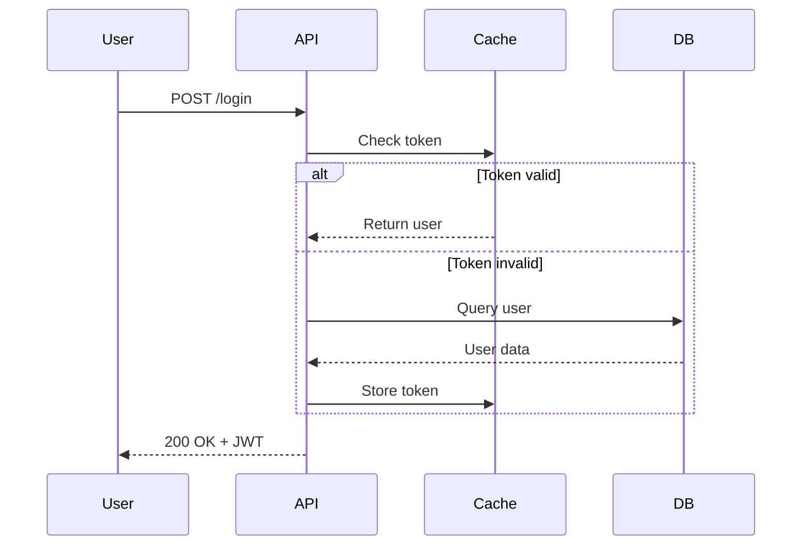

# Claude Code 使用技巧全集

> 本文档整合了来自 vibecoding 实战经验、Reddit 社区和 GitHub 最佳实践，经过 ultrathink 深度分析筛选的高价值技巧，**文章收集的多是比较杂但是重要的技巧，至于ultrathink，如何开启 `--dangerously-skip-permissions`模式的等常用技巧，有很多帖子都有讲述，不再赘述**。

---

## 📋 目录

- [核心理念](#核心理念)
- [核心配置](#核心配置)
- [多 Agent 协作](#多-agent-协作)
- [上下文管理](#上下文管理)
- [代码质量保障](#代码质量保障)
- [高级功能](#高级功能)
- [安全与最佳实践](#安全与最佳实践)
- [工具与集成](#工具与集成)

---

### 最重要的观点：能封装的东西就封装！！

#### 分享一个提供配置cc的项目，方便快速冷启动https://github.com/davila7/claude-code-templates，仅针对新手，想真正用好还是得靠自己


## 核心理念

### Context Engineering vs Vibe Coding ⭐⭐⭐⭐⭐

这是使用 Claude Code 的**根本性思维转变**。

#### Vibe Coding ❌
- 随意提示，期待奇迹发生
- "帮我修复这个 bug"（没有上下文）
- 没有系统性方法
- 结果不可预测

#### Context Engineering ✅
- **系统性设计上下文**，产生可预测的高质量输出
- 通过 CLAUDE.md、Slash Commands、Hooks 精心构建上下文
- 可复现、可优化的工作流
- 结果可控且高效

**核心洞察**:
> "90% of traditional programming skills are becoming commoditized while the remaining 10% becomes worth 1000x more. That 10% isn't coding, it's knowing how to design distributed systems, how to architect AI workflows."

---

### 软件工程核心原则 ⭐⭐⭐⭐⭐

这些原则同样适用于 AI 编程，甚至更加重要。

#### 1️⃣ DRY (Don't Repeat Yourself)
```markdown
## CLAUDE.md 中声明：

- ✅ Zero code duplication will be tolerated
- ✅ Each functionality must exist in exactly one place
- ❌ No duplicate files or alternative implementations allowed
```

#### 2️⃣ KISS (Keep It Simple, Stupid)
```markdown
- ✅ Implement the simplest solution that works
- ❌ No over-engineering or unnecessary complexity
- ✅ Straightforward, maintainable code patterns
```

#### 3️⃣ Clean File System
```markdown
- ✅ All existing files must be either used or removed
- ❌ No orphaned, redundant, or unused files
- ✅ Clear, logical organization of the file structure
```

#### 4️⃣ 透明错误处理 ⭐⭐⭐⭐⭐
```markdown
## 错误处理原则（极其重要！）

❌ 禁止做的事：
- No error hiding or fallback mechanisms that mask issues
- No silent failures
- No generic "something went wrong" messages

✅ 必须做的事：
- All errors must be properly displayed to the user
- Errors must be clear, actionable, and honest
- Include context: what failed, why, how to fix

# CLAUDE.md 示例
## Error Handling
- Never hide errors with fallback systems
- Always display the actual error to users with context
- Error messages must be actionable (tell user how to fix)
```

**为什么这条极其重要**:
- AI 倾向于"隐藏"错误让代码"看起来能运行"
- 这会埋下难以发现的 bug
- 透明的错误能立即暴露问题

---


### CLAUDE.md 最佳实践 ⭐⭐⭐⭐⭐

`CLAUDE.md` 是项目中最重要的文件，是 Claude 的"宪法"。以下是编写高效 `CLAUDE.md` 的核心原则：

#### 1️⃣ 从错误开始，不写手册
- **不要**预先写完整手册
- **应该**基于 Claude 实际犯的错误逐步添加指南
- 记录 Claude 做错的事，然后文档化正确做法

```markdown
# 示例: 基于错误的文档化
## Python
- ❌ Claude 常错误使用 `--foo-bar` flag
- ✅ 永远不要用 `--foo-bar`，使用 `--baz` 替代
- 测试命令: `pytest tests/`

## 内部 CLI 工具
- ❌ Claude 常忘记运行预检查
- ✅ 任何部署前必须先运行 `./scripts/preflight-check.sh`
```

#### 2️⃣ 不要 @-file 引用文档
- **问题**: `@mention` 文件会把整个文件嵌入上下文，浪费 tokens
- **解决**: 只提及路径，并说明**何时**和**为什么**要读它

#### 3️⃣ 不只说"Never"，提供替代方案
- **问题**: 纯否定约束会让 agent 卡住
- **解决**: 永远提供替代方案

```markdown
❌ 错误做法:
永远不要使用 `rm -rf`

✅ 正确做法:
永远不要使用 `rm -rf`，使用 `trash` 命令替代，或者在删除前先用 `ls` 确认目标。
```

#### 4️⃣ 用作简化工具的强制函数
- 如果命令太复杂需要大量文档，**不要写文档**
- **应该**写一个简单的 bash wrapper
- 保持 `CLAUDE.md` 简短是简化工具链的强制函数

```markdown
❌ 复杂命令需要 3 段文档:
使用 kubectl 时需要指定命名空间、上下文、输出格式...

✅ 简化为 wrapper:
使用 `./scripts/k8s-deploy.sh <service>` 部署服务
```

#### 5️⃣ Token 预算分配 (特别重要！)
- 为每个工具分配"广告位"（token 限额）
- 如果工具无法简洁解释，说明还没准备好放进 `CLAUDE.md`
- 推荐: 大型仓库限制在 13-25KB

---

## 多 Agent 协作

### 文件系统通信：让多个 Agents 协作 ⭐⭐⭐⭐⭐

Sub-agents 的上下文隔离既是优点也是缺点。通过**文件作为中介**可以实现优雅的协作。

#### 工作流示例 (planner → coder → reviewer)

```bash
# 1. 规划阶段
claude_1 "@planner 帮我规划一个用户认证 API，
将详细设计方案写入 .claude/docs/auth_spec.md"

# 2. 编码阶段
claude_2 "@coder 请根据 .claude/docs/auth_spec.md
的设计方案，实现相关代码"

# 3. 审查阶段
claude_3 "@code-reviewer 审查刚才生成的代码，
确保其符合 auth_spec.md 的所有要求"
```

#### 最佳实践
- 规范文件路径: `.claude/docs/`、`.claude/specs/`（<u>选用.claude路径的好处是，能够明确这是给AI读的，提交时候.gitignore也好写，但是在功能上没有本质区别</u>）
- 明确文件职责: 每个文件对应一个阶段的输出
- 保留文件: 这些文件也是项目文档的一部分

---

### Subagent 使用：强制规则 + Task 工具 ⭐⭐⭐⭐⭐

#### 核心概念澄清

**Subagent（专业代理）**：
- 通过 **Task 工具**启动的专业 agent
- 包括官方内置（python-pro, frontend-developer）和插件提供的
- **关键**：都能访问 CLAUDE.md，共享上下文

**两个层面的控制**：

##### 1. 强制规则（防止 Agent 偷懒）

在 CLAUDE.md 中明确规定何时**必须**使用 subagent：

```markdown
# CLAUDE.md

## 🚨 核心规则：专业任务必须使用专业 Subagent

| 任务类型 | 必须使用 |
|---------|---------|
| Python 代码 | python-pro |
| TypeScript 代码 | typescript-pro |
| 架构设计 | backend-architect |
| 代码审查 | code-reviewer |

## 技术栈
- Python + FastAPI
- 测试：pytest
```

**为什么需要强制？**
- ❌ 主 Agent 会偷懒："这个简单，我直接写..."
- ✅ 强制使用专业 subagent 确保质量

---

##### 2. 灵活决策（智能选择，但是大概率会偷懒）

对于复杂任务，让主 Agent 根据情况选择合适的 subagent：

```markdown
# CLAUDE.md

复杂任务会自动委派给专业 agent。
```

**主 Agent 智能判断**：
```
任务："优化这个项目"

主 Agent 分析：
- 数据库慢 → Task(subagent_type="database-optimizer")
- 前端慢 → Task(subagent_type="performance-engineer")
- 代码质量 → Task(subagent_type="code-reviewer")
```

---

#### 完整工作流程

```
用户："写一个用户认证 API"

主 Agent：
1. 读取 CLAUDE.md
2. 看到"架构设计 → 必须用 backend-architect"
3. 声明使用 subagent
4. Task(subagent_type="backend-architect", ...)

Backend-Architect Subagent：
✅ 访问 CLAUDE.md（看到技术栈：Python + FastAPI）
✅ 按规范设计 API
✅ 返回设计方案

主 Agent：
"现在用 python-pro 实现"
Task(subagent_type="python-pro", ...)

Python-Pro Subagent：
✅ 访问 CLAUDE.md（看到规范：pytest、Black）
✅ 实现代码
✅ 返回

完成！所有 subagent 都遵循 CLAUDE.md 的规范
```

**推荐配置：CLAUDE.md 强制 + Task 工具执行**

```markdown
# CLAUDE.md - 推荐配置

## 强制规则（防止偷懒）
- Python 代码 → 必须用 python-pro
- 架构设计 → 必须用 backend-architect

## 技术栈和规范
（所有 subagent 都能看到）
- Python + FastAPI
- 测试：pytest
- 覆盖率：80%

## 灵活规则
复杂任务可委派给专业 agent
（主 agent 根据情况选择）
```

**核心理念**：
> 在 CLAUDE.md 中规定规则
> 让主 Agent 用 Task 工具启动 subagent
> 所有 subagent 自动访问 CLAUDE.md

---

### Sub-agents 并行生成 - 保护上下文窗口 ⭐⭐⭐⭐⭐

**Reddit 实战技巧**: 最简单但最有效的 sub-agent 使用方法

#### 简单却强大的方法

```bash
# 不需要预先配置复杂的 subagent
# 直接让主 agent 生成并行 subagent 团队

claude -p "请生成一个 sub-agent 团队并行处理以下任务:
1. Agent A: 优化数据库查询
2. Agent B: 重构前端组件
3. Agent C: 更新 API 文档
4. Agent D: 运行安全扫描

每个 agent 专注自己的任务，完成后汇报结果。"
```

#### 优势 vs 劣势

**优势** ✅:
- **保护上下文窗口** - 每个 subagent 独立上下文
- **并行处理** - 多任务同时进行，效率高
- **编排良好** - 主 agent 自动协调

**劣势** ❌:
- **可观察性降低** - 看不到每个 agent 的详细思考过程
- **需要明确任务** - 任务定义要清晰，避免重叠

#### 实战工作流

```bash
# 示例 1: 调试多个可能原因
claude -p "这个 bug 可能有多个原因。
请生成 3 个 subagent 并行探索:
- Agent 1: 检查数据库连接问题
- Agent 2: 检查 API 超时配置
- Agent 3: 检查缓存失效逻辑

每个 agent 独立调查，汇报发现。"

# 示例 2: 代码审查多个维度
claude -p "请生成专业 subagent 团队审查这次 PR:
- Security Agent: 审查安全漏洞
- Performance Agent: 审查性能影响
- UX Agent: 审查用户体验
- Test Coverage Agent: 审查测试覆盖率

每个 agent 独立评估，提供改进建议。"
```

#### 进阶：定期咨询在线资源

```markdown
# 在 CLAUDE.md 中添加
## Sub-agent Guidelines
- When spawning sub-agents, instruct them to consult online resources regularly
- Each agent should verify their approach against latest documentation
- Agents should report both findings and sources
```

---

### 高级 Agent 编排案例 ⭐⭐⭐⭐⭐

**来自 Reddit 实战**: 22 个专业 Agent 团队配置

#### 核心架构组件

1. **Memory Agent** (持续监控)
   - 唯一职责: 监控和记录所有团队工作
   - 作为团队的共享记忆
   - 定期生成进度摘要
3. **专业领域 Agents**
   - Frontend Agent
   - Backend Agent
   - Database Agent
   - Security Agent
   - Documentation Agent
   - ... (根据项目需要)

#### 示例配置思路

```markdown
# .claude/agents/memory-agent/config.md

你是 Memory Agent，团队的记忆系统。

## 职责
1. 监控所有其他 agent 的工作
2. 记录关键决策和变更
3. 定期生成进度报告
4. 回答"我们之前是怎么做的"类问题

## 输出
- 持续更新 .claude/memory/team-log.md
- 每个重要变更记录到 .claude/memory/decisions/
```

#### 自动化工作流示例

Reddit 用户分享的 `/execute` 命令工作流：

```markdown
# .claude/commands/execute.md

检查 plan.md 中是否有待办任务:

**如果有任务**:
1. Prompt Engineer Agent 审查任务提示词
2. 向用户查询缺失的上下文
3. 使用 Anthropic 文档将任务转换为 XML
4. Orchestrator 根据提示词分配专业 subagent
5. UI Expert Agent 用 Playwright MCP 截图验证
6. Security + Senior Engineer 审查和测试
7. Documentation Expert 更新文档

**如果没有任务**:
1. 启动 Brainstorm Mode
2. Feature Innovator Agent 与用户对话
3. 深度互联网研究可行性和市场空白
4. 建议创新功能
5. 用户选择后添加到 plan.md
```

---

### 什么时候不要用 Subagent

- **简单任务**: 适合单一 agent 完成
- **需要全局上下文**: Subagent 与主 agent 上下文隔离，会丢失全局信息
- **探索性任务**: 用 `Task(...)` 和 Explore agent 更灵活

#### Subagent 资源
- https://github.com/VoltAgent/awesome-claude-code-subagents
- https://github.com/wshobson/agents
- https://github.com/vanzan01/claude-code-sub-agent-collective

---


## 上下文管理

### 上下文窗口管理策略 ⭐⭐⭐⭐⭐

即使有 200k token 上下文窗口，也需要主动管理。运行 `/context` 查看使用情况。

#### 三种重启策略

| 策略 | 复杂度 | 适用场景 | 推荐度 |
|------|--------|----------|--------|
| `/compact` | 自动 | - | ❌ **避免使用** |
| Document & Clear | 复杂 | 大任务 | ✅ **大任务必用** |

#### 1️⃣ 避免 /compact
- 自动压缩是**不透明的**、易出错的
- 不能很好地优化

#### 2️⃣ Document & Clear (大任务) ⭐⭐⭐⭐

**Reddit 实战技巧**: 用 Progress.md 记录进度

```bash
# 步骤 1: 让 Claude 记录当前进度
claude -p "将当前的开发计划和进度写入
.claude/progress/feature-x.md"

# 步骤 2: 清空上下文
/clear

# 步骤 3: 继续工作
claude -p "读取 .claude/progress/feature-x.md
并继续实现"
```

**一些窍门** (来自 Veraticus):

> 虽然 Claude 不会自动执行"当上下文过长时重新读取 CLAUDE.md"这类指令，但在 CLAUDE.md 中明确写出这些期望会让 Claude **think harder and remember more**。

**推荐的 CLAUDE.md 声明**:
```markdown
## Context Management Guidelines

当上下文窗口变长时:
1. 重新读取这个 CLAUDE.md 文件
2. 将当前进度总结到 .claude/progress/PROGRESS.md
3. 在重大变更前记录当前状态

虽然你不会自动执行这些，但这是期望的工作方式。
```

**虽然作者说的很好，但是还是以设计优秀的上下文作为核心，毕竟CLAUDE.md寸土寸金**，个人选择性使用

---


## 代码质量保障

### Mermaid 图辅助 Bug 分析 ⭐⭐⭐⭐⭐

这是一个**非常独特且有效**的调试方法，优于传统的写 test case。

#### 为什么有效?
- **传统问题**: AI 写的 test case 常常过拟合，为了通过测试反而改代码
- **Mermaid 方案**: 通过可视化设计，让 AI 做 code review + system design audit

#### 完整工作流

```bash
# 步骤 1: 用 Claude 网页版生成 Mermaid 图
"请帮我画出这个用户认证模块的时序图和调用流程图"

# 步骤 2: Review 并修正图表
"这里的登录流程不对，应该先检查缓存再查数据库"

# 步骤 3: 保存到项目
# 将最终的 mermaid 代码保存为:
# docs/diagrams/auth-flow.mermaid

# 步骤 4: 用 Claude Code 分析
claude -p "读取 docs/diagrams/auth-flow.mermaid，
Carefully analyze the code against the use cases
in the Mermaid diagram to identify any missing
functionality or bugs."
```

#### 示例 Mermaid 图


#### 效果
- 能发现设计层面的遗漏
- 发现逻辑 bug（测试覆盖不到的）
- 作为活文档，团队也能理解

---

### Hooks

**核心理念**: Hooks 提供确定性的"必须做"规则,补充 CLAUDE.md 的"应该做"建议，推荐使用场景举例如下：

#### 🎯 关键原则

**✅ 在提交时检查** (Block-at-Submit)
```json
// .claude/hooks.json
{
  "preToolUse": {
    "Bash": {
      "pattern": "git commit",
      "script": "./scripts/check-tests-pass.sh"
    }
  }
}
```

**❌ 不要在写代码时阻止** (Block-at-Write)
- 在 `Edit`/`Write` 时阻止会困惑 agent
- 让 agent 先完成代码,再在 commit 时统一检查


---

### TDD with AI - 调试时间减少到 1/10 ⭐⭐⭐⭐⭐

**这可能是最被低估但影响最大的技巧**。来自 Reddit 社区的实战验证：

> "The thing that had the most impact on my work with AI was learning how to use TDD with AI. This made my time debugging when using AI to like **1/10th**."

#### 为什么 AI + TDD 特别有效？

**传统认知**: 有测试就够了

**实战发现**: AI 与 TDD 有独特的协同效应

**关键洞察**:
> "There's a whole level of nuance between having tests and **systematically applying TDD**, especially when dealing with AI both writing the tests and making them pass. **AIs interact very differently with a given task when doing it through elaborating passing tests. It can be an insanely good tool for constraining the AI's work.**"

#### AI + TDD 的独特价值

1. **约束 AI 的工作范围** - 测试明确定义了"完成"的标准
2. **减少过度工程** - AI 只实现让测试通过的代码
3. **立即验证** - 每一步都有明确的成功/失败反馈
4. **减少幻觉** - 测试提供了现实检查
5. **调试效率 10x** - 问题立即暴露，而不是埋在代码深处

#### 完整 TDD 工作流

```bash
# 🔴 步骤 1: Red - AI 写失败测试
claude -p "为用户登录功能写测试，使用 TDD 方法。
要求:
1. 测试应该失败（因为功能还没实现）
2. 测试场景：
   - 正确用户名密码 → 返回 JWT token
   - 错误密码 → 返回 401
   - 不存在的用户 → 返回 404
3. 使用 pytest，清晰的测试名称"

# 验证测试失败
pytest tests/test_auth.py -v
# ❌ FAILED (符合预期)

# 🟢 步骤 2: Green - AI 实现最小可行代码
claude -p "实现登录功能，让所有测试通过。
使用最简单的实现，不要过度工程。"

# 验证测试通过
pytest tests/test_auth.py -v
# ✅ PASSED

# 🔵 步骤 3: Refactor - 优化代码
claude -p "重构登录代码，保持测试通过。
优化点：
1. 提取重复逻辑
2. 改善可读性
3. 添加必要注释"

# 再次验证
pytest tests/test_auth.py -v
# ✅ PASSED
```

#### 配合 Hook 强制 TDD

```json
// .claude/hooks.json
{
  "preToolUse": {
    "Bash": {
      "pattern": "git commit",
      "script": "pytest && touch /tmp/agent-pre-commit-pass || exit 1"
    }
  }
}
```

#### 与传统测试的区别

| 维度 | 传统"有测试" | AI + 系统性 TDD |
|------|------------|----------------|
| 测试时机 | 代码写完后 | 代码写之前 |
| AI 行为 | 可能过度工程 | 被测试约束 |
| 调试时间 | 长（bug 埋得深） | 短（立即暴露）|
| 代码质量 | 不确定 | 高（每步验证）|

#### 实战技巧）重要

1. **测试先行，不是事后补**
   ```bash
   # ❌ 错误
   claude -p "实现功能" → 然后 → "写测试"
   
   # ✅ 正确
   claude -p "写测试" → 验证失败 → "实现功能" → 验证通过
   ```

2. **让 AI 理解 TDD 循环**
   ```markdown
   # 在 CLAUDE.md 中声明
   ## Testing Approach
   - **Always use TDD (Test-Driven Development)**
   - Red → Green → Refactor cycle is mandatory
   - Write failing test first, then implement
   - Keep implementations simple (YAGNI)
   ```

3. **测试即规范**
   ```python
   # 测试本身就是最好的需求文档
   def test_user_login_with_valid_credentials_returns_jwt():
       """
       Given: 有效的用户名和密码
       When: 调用登录 API
       Then: 返回 200 和 JWT token
       """
   ```

---


### 两级代码审查 ⭐⭐⭐⭐

平衡**意图验证**与**代码质量**。

1. **第一级**: AI 的开发者审阅草稿 PR，验证实现符合意图
2. **第二级**: 另一个开发者审查正式 PR，确保代码质量

```bash
# 第一级审查
claude -p "审查我刚才的实现，
确保符合 .claude/docs/auth_spec.md 的设计"

# 第二级审查 (由人类进行)
# 或使用 @code-reviewer agent
```

---


## 高级功能

### Planning Mode - 真正让代码 Bulletproof ⭐⭐⭐⭐⭐

**Reddit 社区共识**: "Planning is what makes it 100% bulletproof, not just CLAUDE.md"

> "/plan mode is under rated. CLAUDE.md is important, but not what will make it 100% bulletproof. **Planning is.**"

#### 何时使用
- 涉及多个文件的修改
- 新功能实现
- 架构调整
- 复杂 bug 修复

#### 定义检查点
```markdown
在计划中明确检查点:
1. 实现数据模型 ← 检查点 1
2. 实现 API 端点 ← 检查点 2
3. 添加测试 ← 检查点 3
4. 集成到前端 ← 检查点 4
```

#### 自定义 Planning Tool
企业级项目可以基于 Claude Code SDK 构建自定义规划工具，强制执行：
- 公司的技术设计格式
- 安全和隐私最佳实践
- 架构标准

---

### Skills vs MCP 哲学 ⭐⭐⭐⭐

#### 核心理念：让 AI 自己思考，而非预设所有可能

**传统 MCP 问题**：为每个操作预定义工具 → 工具爆炸 → 占用大量上下文

**Skills 解决方案**：给 AI 访问原始工具 + 使用指南 → AI 自己组合 → 灵活高效

---

#### Agent 自主性的三个阶段

| 阶段 | 方式 | 问题 | 适用性 |
|------|------|------|--------|
| **Single Prompt** | 一次性给所有上下文 | 不可扩展，上下文快满 | ❌ 已淘汰 |
| **Tool Calling (MCP)** | 预定义工具函数 | 工具爆炸，不够灵活 | ⚠️ 需优化 |
| **Scripting (Skills)** | 访问原始环境 + 指南 | - | ✅ **推荐** |

---

#### Skills 的核心价值

**本质**：Skill 是"使用说明书"，不是"预定义函数"

**类比**：
- **MCP** = 外卖 App（菜单固定，只能点菜单上的菜）
- **Skills** = 教做饭（给食材和食谱，可以自由组合）

**示例**：部署到 Kubernetes

```markdown
# .claude/skills/k8s-deploy/SKILL.md

## 可用工具
- kubectl (已安装)

## 标准部署流程
1. 检查 context: `kubectl config current-context`
2. 部署应用: `kubectl apply -f k8s/`
3. 验证状态: `kubectl get pods`

## 常见问题
- ImagePullError → 检查镜像名称
- CrashLoopBackOff → 查看日志 `kubectl logs <pod>`
```

**关键**：Claude 读取这个文档后，能够：
- 理解部署流程
- 自己组合命令
- 处理各种变化（不同 namespace、不同应用）
- 解决常见问题

**而不是**：为每种操作预定义 MCP 工具（`deploy_to_dev()`, `deploy_to_staging()`, `deploy_to_prod()`...）

---

#### MCP 的正确定位：数据网关，而非 API 镜像

**❌ 错误用法**：API 镜像（工具爆炸）
```
为每个 API 端点创建一个 MCP 工具：
- get_user_by_id()
- get_user_by_email()
- update_user_name()
- delete_user()
... 50 个工具 → 占用 25k tokens
```

**✅ 正确用法**：数据网关（轻量简洁）
```
只提供通用访问：
- api_call(endpoint, method, data)

1 个工具 → 占用 500 tokens
Claude 自己组合各种查询
```

**核心原则**：
> MCP 提供"原始数据访问"，让 Claude 自己处理
> 而不是预设"所有可能的操作"

**实际效果**：
- Token 占用减少 98%
- 灵活性提升（处理任意新需求）
- 维护成本降低（API 变更无需修改 MCP）

---

#### 何时用 MCP vs Skills？

| 需求 | 用 MCP | 用 Skills |
|------|--------|-----------|
| 严格权限控制 | ✅ | ❌ |
| 访问外部 API（需认证） | ✅ | ❌ |
| 复杂数据处理 | ✅ | ❌ |
| 使用已有 CLI 工具 | ❌ | ✅ |
| 文件操作和脚本 | ❌ | ✅ |
| 项目特定工作流 | ❌ | ✅ |

**最佳实践**：MCP（数据访问）+ Skills（使用指南）= 完美组合

---

### 自定义命令的哲学 ⭐⭐⭐⭐⭐

#### 核心洞察：命令的价值在于"强迫思考"

**Reddit 深刻发现**：Slash Commands 的真正价值不是模板本身

> "命令的主要作用是**强迫用户在输入前先思考**。重点不在于模板，而在于**认真思考如何解释你想要 Claude 做什么**。"

---

#### 简单 > 复杂

**✅ 推荐**：2-5 个精心设计的命令
```
.claude/commands/
├── catchup.md    # 读取 git 变更，快速同步
└── pr.md         # 清理代码，准备 PR
```

**❌ 反模式**：20+ 个命令（像学新工具一样学命令）
```
过多的命令反而增加认知负担：
- 记不住哪个命令干什么
- 失去了 AI 自然语言的优势
- 本质上在"训练人"而非"用 AI"
```

---

#### 为什么少即是多？

1. **Claude 的价值 = 自然语言理解**
   - 如果需要学魔法命令 → 失去了 AI 的意义
   - 直接说"帮我准备 PR"也很好

2. **命令 ≠ 自动化，而是思考提示**
   - 好命令：提醒你思考清楚需求
   - 坏命令：试图替代思考

3. **个人快捷方式，不是团队标准**
   - 命令应该反映你的个人习惯
   - 不是让所有人学习的"API"

**核心原则**：
> 命令的作用是**强制你思考**，而不是**自动化思考**

#### Slash Commands 真正的价值

**不是**模板的内容有多完美
**而是**它强迫你回答这些问题:

```markdown
修复这个 bug?

真正需要思考的:
- Which bug? (哪个 bug?)
- What language? (什么语言?)
- What module? (哪个模块?)
- What environment? (什么环境?)
- 修复 = 功能不同? 还是 = 不抛错误?
```

**人类是糟糕的沟通者**。Slash Commands 通过**结构化**帮你想清楚。

#### 示例: /catchup 命令
```markdown
# .claude/commands/catchup.md
请读取当前 git 分支相对于 main 的所有变更文件。

步骤:
1. `git diff --name-only main...HEAD`
2. 读取这些文件
3. 给我一个简短总结
```

#### 实战建议

**从重复工作流中提炼命令**:
```bash
# 你发现自己总是这样做:
1. 查看改动: git status
2. 读文件: Read A, B, C
3. 让 Claude 总结

# 创建命令固化这个流程
# .claude/commands/review-changes.md
```

**命令是个人的，不是团队的**:

- 每个人工作方式不同
- 不要强制团队使用统一的命令库
- CLAUDE.md 是团队共享，Commands 是个人优化

---


### Claude Code SDK 三大用途 ⭐⭐⭐⭐

#### 1️⃣ 大规模并行脚本

不要用交互式聊天做批量任务，写脚本！

```bash
#!/bin/bash
# 批量重构: 把所有 foo 改成 bar

for dir in services/*/; do
  claude -p "in $dir change all references from foo to bar" &
done
wait

echo "✅ 所有服务重构完成"
```

#### 2️⃣ 构建内部工具

为非技术人员提供聊天界面。

```python
# 示例: 安装修复工具
from claude_code_sdk import Claude

claude = Claude()

try:
    install_app()
except Exception as e:
    print("安装失败，启动 AI 修复...")
    claude.chat(f"安装遇到错误: {e}，请修复")
```

#### 3️⃣ 快速原型

测试任何 agentic 想法。

```python
# 威胁调查 agent
from claude_code_sdk import Claude

claude = Claude()
claude.add_mcp_server("security-logs")

result = claude.chat("""
分析最近 24 小时的可疑登录行为，
生成威胁报告。
""")
```

---


### Meta-Learning: 让 Claude 审查自己的 Prompt ⭐⭐⭐⭐⭐

**这是一个持续改进的强大循环**。

#### 核心思想

每次完成代码后，让 Claude 分析整个过程，生成更好的 prompt 用于下次。

#### 完整工作流

```bash
# 步骤 1: 完成代码开发
claude -p "实现用户认证功能"
# ... 开发过程 ...

# 步骤 2: 让 Claude 进行 Meta 分析
claude -p "请回顾刚才的开发过程，分析:

1. 审查我的原始需求和最终代码的匹配度
2. 开发过程中哪些地方出现了问题或反复修改?
3. 什么原因导致了这些问题? (需求不清? 上下文缺失?)
4. 哪些信息我开始没提供，你后来不得不猜测?
5. 我的 prompt 组织得如何? 哪里可以改进?
6. 如果重新开始，理想的 prompt 应该是什么样的?

请详细分析，并生成一个'理想 prompt'模板。"

# 步骤 3: 应用到下次项目
# 使用 Claude 生成的"理想 prompt"开始新项目
```

#### 示例对话

**你的问题**:
```
分析刚才实现认证功能的过程:
- 哪里卡住了?
- 哪里我没说清楚?
- 怎么改进我的 prompt?
```

**Claude 可能的反馈**:
```markdown
## 分析报告

### 问题点
1. ❌ 你说"实现认证"但没说用什么方案 (JWT? Session?)
2. ❌ 没说明数据库已有 User 表，我浪费时间设计表结构
3. ❌ 没说明项目用 FastAPI，我用了 Flask
4. ✅ 测试要求很清晰

### 理想 Prompt 模板

在 {tech_stack} 项目中实现 {feature}。

**技术栈**:
- Framework: FastAPI 0.100+
- Database: PostgreSQL (User 表已存在)
- Auth: JWT tokens

**需求**:
1. [具体需求 1]
2. [具体需求 2]

**约束**:
- 使用现有 User 模型 (位于 models/user.py)
- Token 有效期 24 小时
- 包含单元测试

**成功标准**:
- 所有测试通过
- 符合 CLAUDE.md 规范
```

#### 实战技巧

**1. 定期进行 Meta 回顾**
```bash
# 每个里程碑或 PR 完成后
/meta-review
```

**2. 积累 Prompt 模板库**
```bash
.claude/prompts/
├── feature-implementation.md
├── bug-fix.md
├── refactoring.md
└── code-review.md

# 每次 Meta-learning 后更新这些模板
```

**3. 在 CLAUDE.md 中声明学习机制**
```markdown
## Meta-Learning Protocol
- After significant implementations, ask me to review the process
- Identify what information was missing upfront
- Generate improved prompt templates
- Continuously refine our communication patterns
```

---


### Resume & Continue ⭐⭐⭐⭐

#### 重启会话
```bash
# 查看历史会话
claude --history

# 恢复某个会话
claude --resume <session-id>

# 继续上一个会话
claude --continue
```

#### 从历史中学习
```bash
# 恢复几天前的会话，了解如何解决某个问题
claude --resume abc123

"总结一下你当时是如何解决 XYZ 错误的"

# 用这个信息改进 CLAUDE.md
```

#### 元分析历史数据
```bash
# 所有会话存储在
~/.claude/projects/

# 分析常见错误模式
grep -r "Error" ~/.claude/projects/ | \
  claude -p "分析这些错误，建议如何改进 CLAUDE.md"
```

---


## 安全的最佳实践

### 安全实践 ⭐⭐⭐⭐⭐

#### 权限控制与安全策略 🔐

> **核心理念**: 读取无限制，修改需谨慎，危险操作绝对禁止

---

### 📋 权限控制方案对比

#### ❌ 方案 A：Bypass Permissions 模式（不推荐）

```bash
# 命令行方式
claude --dangerously-skip-permissions  # 危险！

# 或在界面开启
🔓 Bypass Permissions: ON
```

**问题**：
- ❌ 跳过所有 `ask` 规则的确认
- ❌ 可能导致误删除、误修改
- ❌ 仅适用于完全隔离的测试环境
- ❌ 一旦忘记关闭，风险持续存在

---

#### ⚖️ 方案 B：传统保守配置

```json
{
  "permissions": {
    "allow": ["Bash(git status)", "Bash(ls:*)"],  // 仅 9 条
    "ask": ["Bash(rm:*)", "Edit(*)", "Write(*)"], // 所有修改都要确认
    "deny": ["Bash(curl:*)", "Read(.env)"]
  }
}
```

**问题**：
- 🟡 安全性高，但效率低
- 🟡 频繁打断（~20 次/小时）
- 🟡 读取敏感文件被拒绝，调试不便

---

#### ✅ 方案 C：极致效率版（强烈推荐 ⭐⭐⭐⭐⭐）

```json
{
  "permissions": {
    "allow": [
      // 150+ 条规则：所有常用开发命令
      "Bash(git status)", "Bash(git diff:*)", "Bash(git add:*)", "Bash(git commit:*)",
      "Bash(npm install:*)", "Bash(npm test:*)", "Bash(npm run:*)",
      "Bash(docker build:*)", "Bash(docker run:*)", "Bash(docker compose:*)",
      "Bash(ls:*)", "Bash(cat:*)", "Bash(grep:*)", "Bash(find:*)",
      "Bash(python:*)", "Bash(pip:*)", "Bash(pytest:*)",
      "Bash(cargo:*)", "Bash(go:*)", "Bash(kubectl get:*)",
      // ... 150+ 条规则覆盖 95% 日常操作
    ],
    "ask": [
      // 38 条规则：仅危险操作需确认
      "Bash(rm:*)", "Bash(mv:*)", "Bash(sudo:*)",
      "Bash(git push --force:*)", "Bash(git reset --hard:*)",
      "Edit(./package.json)", "Edit(./tsconfig.json)",
      "Bash(docker rm:*)", "Bash(kubectl delete:*)"
    ],
    "deny": [
      // 22 条规则：绝对禁止的操作
      "Bash(rm -rf .:*)", "Bash(rm -rf /:*)",
      "Bash(curl:*)", "Bash(wget:*)",
      "Edit(./.claude/**)", "Edit(./.env)",
      "Write(./.claude/**)", "Write(./.env)"
      // 注意：Read 不在 deny 中！
    ]
  }
}
```

**优势**：
- ✅ **读取完全自由**：可以读取 `.env`、`.ssh`、`secrets/` 等任何文件
- ✅ **开发零打断**：git、npm、docker 等常用命令直接执行
- ✅ **精准保护**：删除、修改关键文件需确认
- ✅ **绝对安全**：系统破坏、外网访问、修改敏感配置被禁止
- ✅ **效率提升 90%**：确认次数从 ~20 次/小时降到 ~2 次/小时

---

### 🎯 极致效率版详细说明

#### 1️⃣ 读取权限（完全开放）

```bash
# ✅ 所有读取操作零打断
cat .env                    # 直接显示
cat ~/.ssh/id_rsa.pub       # 直接显示
cat ~/.aws/credentials      # 直接显示
cat secrets/api_keys.txt    # 直接显示

# ✅ 读取任何文件都不需要确认
Read(.env)      → 直接执行
Read(~/.ssh/**) → 直接执行
Read(secrets/**)→ 直接执行
```

**设计理念**：
- 读取是调试的必要手段
- 读取不会修改数据，风险可控
- 敏感信息仅在本地上下文中，不会外传（基于对 Claude Code 的信任）

#### 2️⃣ 修改权限（需要确认）

```bash
# 🟡 删除/移动文件需确认
rm test.txt         → 弹窗确认 → Allow
mv old.txt new.txt  → 弹窗确认 → Allow

# 🟡 修改关键配置需确认
Edit(package.json)  → 弹窗确认 → Allow
Edit(tsconfig.json) → 弹窗确认 → Allow
```

#### 3️⃣ 禁止操作（绝对拒绝）

```bash
# 🚫 修改敏感文件
echo "KEY=val" >> .env  → Permission denied
Edit(./.claude/**)      → Permission denied

# 🚫 外网访问
curl https://...        → Permission denied
wget https://...        → Permission denied

# 🚫 系统破坏
rm -rf .                → Permission denied
rm -rf ~/.claude        → Permission denied
```

---

### 🛡️ .claude/ 目录精细化保护

**核心问题**: 需要经常修改 `.claude/` 下的文档和配置，但要防止误删除或批量修改。

#### ❌ 错误做法

```json
// 完全禁止访问 - 太极端，无法正常工作！
{
  "permissions": {
    "Edit": { "deny": [".claude/**/*"] },
    "Write": { "deny": [".claude/**/*"] }
  }
}
```

#### ✅ 正确做法：分层保护

```json
{
  "permissions": {
    "deny": [
      // 禁止所有删除 .claude 的 Bash 命令
      "Bash(rm .claude:*)",
      "Bash(rm ./.claude:*)",
      "Bash(rm -r .claude:*)",
      "Bash(rm -rf .claude:*)",
      "Bash(rmdir .claude)",

      // 禁止修改 .claude 目录下的文件
      "Edit(./.claude/**)",
      "Write(./.claude/**)"
    ],
    "allow": [
      // 允许读取 .claude 目录（调试、学习）
      "Read(./.claude/**)"
    ]
  }
}
```

**效果**：
- ✅ 允许读取 `.claude/` 文件（无限制）
- 🚫 禁止修改 `.claude/` 文件（Edit/Write 被拒绝）
- 🚫 完全禁止删除 `.claude/`（rm 被拒绝）
- 🔒 即使 Bypass Permissions 开启，也无法绕过

#### CLAUDE.md 行为准则

在 CLAUDE.md 中声明 AI 的行为规范：

```markdown
# CLAUDE.md

## .claude/ Directory Access Rules

### 读取权限 (无限制)
- ✅ 可以随时读取 `.claude/` 下的任何文件
- ✅ 可以分析命令、hooks、配置

### 写入权限 (绝对禁止)
- 🚫 **禁止修改** `.claude/` 下的任何文件
- 🚫 **禁止删除** `.claude/` 目录或其中的文件
- 🚫 **禁止运行**: `rm -rf .claude`、`rm .claude/*.json` 等

### 如需修改配置
如果用户要求修改 `.claude/` 配置：
1. 明确告知用户当前配置禁止修改
2. 建议用户自行手动编辑文件
3. 或临时调整权限配置后再操作
```

---

### 🚨 血泪教训案例

#### 真实事故 1（来自 Reddit）

```bash
用户: "清理一下项目文件"
Claude: *运行 rm -rf ~/.claude*
结果: 所有项目历史、命令、配置全部丢失 💥
```

**防护**: `deny` 规则禁止 `rm .claude`，即使 Bypass 开启也无法执行

#### 真实事故 2（开发调试）

```bash
用户: "帮我读取 .env 文件看看配置"
旧配置: Permission denied (Read(.env) 被禁止)
结果: 无法调试环境变量问题，效率低下 😤
```

**解决**: 新配置允许读取 `.env`，但禁止修改


### 🎯 推荐使用方式

#### 步骤 1：配置权限文件

编辑 `~/.claude/settings.json`：
```json
{
  "permissions": {
    "allow": [
      // 复制"极致效率版"的 150+ 条 allow 规则
      "Bash(git status)", "Bash(git add:*)", ...
    ],
    "ask": [
      // 复制 38 条 ask 规则
      "Bash(rm:*)", "Bash(mv:*)", ...
    ],
    "deny": [
      // 复制 22 条 deny 规则
      "Bash(rm -rf .:*)", "Edit(./.claude/**)", ...
    ]
  }
}
```

#### 步骤 2：关闭 Bypass Permissions

```
界面底部状态栏:
🔓 Bypass Permissions: ON  →  点击  →  🔒 OFF
```

#### 步骤 3：开启 Accept Edits 模式

```
✅ Accept Edits: ON
```

#### 步骤 4：重启 Claude Code

```bash
# macOS: Cmd + Q 完全退出
# 等待 3-5 秒后重新打开
```

---

#### API Keys 管理
```bash
# ✅ 环境变量
export ANTHROPIC_API_KEY="sk-..."

# ✅ OS Keychain
claude config set apiKeyHelper "security find-generic-password -s claude"

# ❌ 永远不要写在代码里
API_KEY = "sk-..."  # 危险!
```

### 最佳实践集合 ⭐⭐⭐

#### 权限管理
- ✅ 从只读权限开始
- ✅ 逐步授予写权限
- ✅ 定期审计 `permissions` 配置

#### 配置管理
- ✅ 提示词版本控制 (`.claude/commands/`)
- ✅ 团队共享配置 (`.mcp.json`)
- ✅ 定期备份 `~/.claude.json`

---


### settings.json 关键配置 ⭐⭐⭐

```json
{
  // 调试和网络沙箱
  "HTTPS_PROXY": "http://localhost:8080",
  "HTTP_PROXY": "http://localhost:8080",

  // 超时设置 (毫秒)
  "MCP_TOOL_TIMEOUT": 120000,
  "BASH_MAX_TIMEOUT_MS": 300000,

  // 企业 API key (用法计费)
  "ANTHROPIC_API_KEY": "${API_KEY_HELPER}",

  // 自动允许的命令
  "permissions": {
    "Bash": {
      "autoApprove": ["git status", "npm test"]
    }
  }
}
```

---

#### 📡 HTTPS_PROXY - 调试神器 ⭐⭐⭐⭐

**作用**: 让你能"偷看" Claude Code 和 Anthropic API 之间的通信内容

**核心原理**:
```
正常流程：
Claude Code → Anthropic API（看不到中间发生什么）

配置代理后：
Claude Code → 代理(localhost:8080) → Anthropic API
              ↑ 可以拦截查看所有请求
```

##### 用途 1: 调试 Token 消耗

**场景**: 你的 tokens 消耗特别快，想知道为什么

**操作步骤**:

```bash
# 1. 安装 mitmproxy（中间人代理工具）
brew install mitmproxy  # macOS
# 或 pip install mitmproxy

# 2. 启动 mitmproxy
mitmproxy --mode regular
# 会监听 localhost:8080

# 3. 配置 Claude Code 使用代理
export HTTPS_PROXY=http://localhost:8080
claude -p "你好"

# 4. 在 mitmproxy 界面查看完整请求
```

**你能看到什么**:

```json
POST https://api.anthropic.com/v1/messages
{
  "system": [
    {
      "text": "You are Claude Code...",  // System Message (5k tokens)
      "cache_control": {"type": "ephemeral"}
    },
    {
      "text": "# MCP Tools\n...",  // MCP 工具定义 (42k tokens)
      "cache_control": {"type": "ephemeral"}
    }
  ],
  "messages": [
    {"role": "user", "content": "你好"}  // 你的消息 (2 tokens)
  ]
}

总计：47,234 tokens
→ 你发现 MCP 占了 42k！原来是 memory-keeper 太臃肿
```

---

##### 何时使用 HTTPS_PROXY？

| 场景 | 是否需要 | 说明 |
|------|---------|------|
| **日常使用** | ❌ 不需要 | 默认配置即可 |
| **调试 token 消耗** | ✅ 推荐 | 查看完整 prompt，定位问题 |
| **优化 MCP 配置** | ✅ 推荐 | 看到每个 MCP 占用的 tokens |
| **理解 Prompt Caching** | ✅ 推荐 | 看到 cache_control 标记 |
| **CI/CD 环境** | ✅ 必须 | 限制网络访问，提高安全性 |
| **企业环境** | ✅ 必须 | 审计日志，合规要求 |

---


### MCP 上下文管理 ⭐⭐⭐⭐⭐

**核心发现**: MCP 工具定义会占用大量上下文,即使不使用也会消耗 tokens!

#### 🧠 MCP 上下文占用机制

很多人误解 MCP 的工作方式:

```markdown
❌ 错误理解:
"MCP 工具只在调用时占用上下文"
→ 不用就不占用 token

✅ 实际情况 (Prompt Caching 优化):
"MCP 工具的**定义**在每次对话开始时就加载"
→ 即使不调用,工具定义也占用 token
→ 但 Anthropic 的 Prompt Caching 会自动缓存工具定义:
  • 第 1 轮: 125% 成本 (写入缓存)
  • 后续轮 (5分钟内): 10% 成本 (缓存命中)
  • 这就是为什么多轮对话不会快速耗尽 200k 上下文
```

#### 💰 成本影响示例 (考虑 Prompt Caching)

```markdown
## 长对话场景 (10 轮对话, 每轮间隔 < 5分钟)

❌ 未缓存的理论成本 (实际不会发生):
- MCP 定义累计: 42,678 × 10 = 426,780 tokens

✅ Prompt Caching 后的实际成本:
- 第 1 轮: 42,678 × 1.25 = 53,348 tokens (写入缓存)
- 第 2-10 轮: 42,678 × 0.10 × 9 = 38,410 tokens (缓存命中)
- 总计: 91,758 tokens (节省 78%!)

⚠️ 但优化仍然重要:
如果优化到只有 context7 (1,844 tokens):
- 第 1 轮: 1,844 × 1.25 = 2,305 tokens
- 第 2-10 轮: 1,844 × 0.10 × 9 = 1,660 tokens
- 总计: 3,965 tokens
- 对比未优化: 节省 87,793 tokens (96%!)
```

#### 🎯 何时需要优化?

❌ **不需要优化的场景**:

1. **一次性短对话**
   ```bash
   claude -p "读取并总结 README"
   # 只发送一次,成本可忽略
   ```

2. **频繁使用 MCP 工具**
   ```bash
   # 如果真的在用 38 个 memory-keeper 工具
   # 那么 26,430 tokens 是值得的
   ```

3. **不在意成本**
   - 要全功能,不差钱
   - 不需要优化

#### 🔧 优化策略

##### 策略 1: 按需禁用 (灵活)

- 默认全部关闭，需要时临时启用

##### 策略 2: 项目级配置 (推荐 ⭐)

- 不同项目，不同配置	
  - 项目 A: 查文档（使用context7 mcp); 
  - 项目 B: Web 测试 (使用playwrite mcp)

##### 策略 3: 审查必要性

```bash
# 检查 MCP server 的工具数量
claude /mcp

# 思考:
# - memory-keeper 有 38 个工具,我真的都用吗?
# - 是否只用 2-3 个核心功能?
# - 能否用 Skills 或简单文件替代?
```

#### 🎓 最佳实践

```markdown
## CLAUDE.md 中声明 MCP 使用原则

## MCP Configuration
- 默认不启用任何 MCP server
- 按项目需求启用特定 MCP
- 定期审查 MCP 工具使用情况
- 优先用 Skills 替代臃肿的 MCP

## MCP 选择指南
- context7: 需要查询库文档时
- playwright: 需要交互式浏览时
- memory-keeper: 需要跨会话持久化时
```

#### ⚠️ 重要提醒

```bash
# 运行诊断检查
claude doctor

# 如果看到这个警告:
# ⚠ Large MCP tools context (~42,678 tokens > 25,000)
#
# 说明你的 MCP 配置过于臃肿!
# 立即优化,避免浪费上下文和成本
```

**延伸阅读**:
- [Anthropic Prompt Caching 公告](https://www.anthropic.com/news/prompt-caching)
- [Prompt Caching 技术文档](https://docs.claude.com/en/docs/build-with-claude/prompt-caching)

---


## 遵守 Spec: 基本原则 ⭐⭐⭐

### 不要做的事
- ❌ 一句话需求 (没上下文)
- ❌ 诱导性提示 ("给你1000万美元")
- ❌ 不给上下文就让 AI 修复
- ❌ 中途按 ESC 取消 (会留下不完整状态)
- ❌ 过多 MCP 工具占用上下文
- ❌ 禁用安全机制 (RM 权限等)

### 案例: 违规记录
真实案例中的常见问题:
1. 违反 opus 模型 token 月度限行
2. 生成到一半按 ESC 停止
3. 启动前没做初始化
4. 过多无用的 MCP 占用窗口
5. 没有系好安全带 (禁用权限)
6. 非封闭项目使用 `--dangerously-skip-permissions`

---

## 参考资源

### 文档
- [官方文档](https://docs.claude.com/claude-code)
- [CLAUDE.md 最佳实践](https://www.anthropic.com/engineering/claude-code-best-practices)
- [Subagents 指南](https://docs.claude.com/en/docs/claude-code/sub-agents)
- [Hooks 文档](https://docs.claude.com/en/docs/claude-code/hooks)

### Subagent 集合
- [awesome-claude-code-subagents](https://github.com/VoltAgent/awesome-claude-code-subagents)
- [wshobson/agents](https://github.com/wshobson/agents)
- [claude-code-sub-agent-collective](https://github.com/vanzan01/claude-code-sub-agent-collective)

### 社区
- [Claude Code Guide](https://github.com/zebbern/claude-code-guide)
- [Vibe Coding 实践](https://blog.sshh.io/)

---

## 版本历史

- **v1.0** - 初始版本，整合 vibecoding 实战经验
- **v1.1** - 添加 zebbern/claude-code-guide 内容
- **v1.2** - ultrathink 深度分析和技巧筛选
- **v1.3** - 整合 Reddit 社区实战技巧 (17个技巧经 ultrathink 分析)
  - 新增: Context Engineering vs Vibe Coding 核心理念
  - 新增: 软件工程核心原则 (DRY, KISS, Clean File System, 透明错误处理)
  - 增强: TDD with AI 深度分析 (调试时间减少到 1/10)
  - 增强: Planning Mode 重要性强化
  - 新增: Sub-agents 并行生成技巧
  - 新增: 高级 Agent 编排案例 (22 agent 团队)
  - 新增: Meta-Learning 循环 (让 Claude 审查自己的 Prompt)
  - 增强: Slash Commands 哲学
  - 新增: 安全实践 (.claude/ 目录保护)
  - 增强: Progress.md 记录进度技巧
- **v1.4** - 新增 MCP 上下文管理核心发现
  - 新增: MCP 工具定义上下文占用机制详解
  - 新增: MCP 成本影响分析和优化策略
  - 新增: 何时需要/不需要优化 MCP 的判断标准
  - 新增: 项目级 MCP 配置最佳实践
- **v1.5** - 权限配置系统深度优化 (2025-12-09)
  - 🔍 **深度分析**: Ultra Think 分析权限系统三层架构
    - 揭示 Bypass Permissions 优先级机制
    - 分析 deny 规则如何绕过 Bypass 模式
    - 确定 settings.json 与运行时开关的关系
  - 🚀 **极致效率版配置** (强烈推荐 ⭐⭐⭐⭐⭐)
    - allow 规则: 9 条 → **150+ 条** (16 倍扩展)
    - ask 规则: 54 条 → **38 条** (精简 30%)
    - deny 规则: 17 条 → **22 条** (增强保护)
    - **读取完全自由**: 移除所有 Read 限制 (Read(.env), Read(~/.ssh/**) 等)
    - **效率提升 90%**: 确认次数从 ~20 次/小时 → ~2 次/小时
  - 📋 **三种方案对比分析**
    - ❌ 方案 A: Bypass Permissions 模式 (不推荐 - 安全风险)
    - ⚖️ 方案 B: 传统保守配置 (安全但低效)
    - ✅ 方案 C: 极致效率版 (安全 + 高效平衡)
  - 🛡️ **.claude/ 目录保护策略**
    - 合并权限控制与安全策略章节
    - 新增血泪教训案例分析
    - 强化 CLAUDE.md 行为准则
  - 📊 **性能对比数据**
    - 详细对比表: Bypass vs 保守 vs 极致效率
    - 真实场景效率测试结果
    - 安全性评估矩阵
  - 📚 **配置文档**
    - 新增: `权限配置-极致效率版.md` 完整说明
    - 新增: 权限矩阵对照表
    - 新增: 分步配置指南
  - 🎯 **核心理念**: 读取无限制，修改需谨慎，危险操作绝对禁止

---

**💡 记住核心原则**:
1. CLAUDE.md 是基础，从错误中学习
2. 用文件让 agents 通信
3. 主动管理上下文窗口
4. 大任务先规划，用检查点验证
5. Hooks 在提交时检查，不在编写时
6. Skills > MCP，简单 > 复杂
7. **MCP 非必要不启用** - 工具定义永久占用上下文
8. **权限配置哲学** - 读取无限制，修改需谨慎，危险操作绝对禁止
9. **拒绝 Bypass 模式** - 用精细化 allow 规则替代 Bypass Permissions