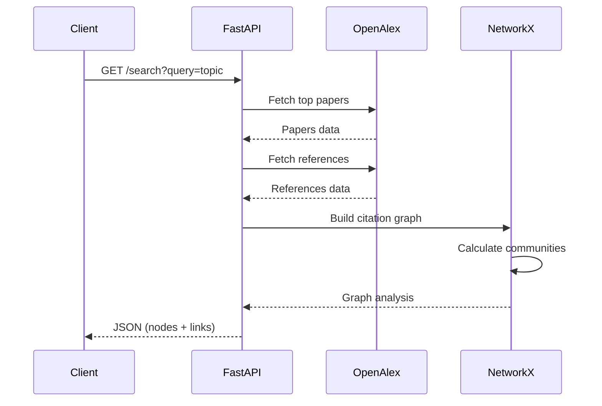

# Academic Paper Analysis Tool - API Documentation

## Overview
REST API for analyzing academic papers and building citation networks using OpenAlex data.

---

## Base URL
```
http://localhost:8000/api
```

---

## Endpoints

### 1. Search Papers and Build Citation Network

**Endpoint**: `GET /search`

**Description**: Search for academic papers by topic and build a citation network graph.

**Query Parameters**:
| Parameter | Type | Required | Default | Description |
|-----------|------|----------|---------|-------------|
| `query` | string | Yes | - | Search keywords (e.g., "machine learning") |
| `limit` | integer | No | 50 | Number of papers to return (1-100) |

**Example Request**:
```bash
GET /api/search?query=deep%20learning&limit=50
```

**Example Response**:
```json
{
  "nodes": [
    {
      "id": "W2123456789",
      "title": "Deep Learning",
      "cited_by_count": 1500,
      "publication_year": 2015,
      "community": 0
    },
    {
      "id": "W2987654321",
      "title": "Neural Networks",
      "cited_by_count": 800,
      "publication_year": 2016,
      "community": 0
    }
  ],
  "links": [
    {
      "source": "W2123456789",
      "target": "W2987654321"
    }
  ],
  "metadata": {
    "total_nodes": 50,
    "total_links": 120,
    "communities": 3
  }
}
```

**Response Schema**:
```typescript
{
  nodes: Array<{
    id: string;              // OpenAlex Work ID
    title: string;           // Paper title
    cited_by_count: number;  // Citation count
    publication_year: number;
    community?: number;      // Cluster ID (from Louvain algorithm)
  }>;
  links: Array<{
    source: string;          // Source paper ID
    target: string;          // Target paper ID (reference)
  }>;
  metadata: {
    total_nodes: number;
    total_links: number;
    communities: number;
  };
}
```

**Error Responses**:
```json
// 400 Bad Request
{
  "detail": "Query parameter is required"
}

// 503 Service Unavailable
{
  "detail": "Failed to fetch papers from OpenAlex API: Connection timeout"
}

// 500 Internal Server Error
{
  "detail": "Internal error: {error_message}"
}
```

---

### 2. Health Check

**Endpoint**: `GET /health`

**Description**: Check API health status.

**Example Request**:
```bash
GET /api/health
```

**Example Response**:
```json
{
  "status": "ok",
  "version": "1.0.0"
}
```

---

## Data Flow



---

## Rate Limiting

- OpenAlex API: No strict rate limit (polite pool)
- Recommended: Max 10 requests/second
- Use caching for repeated queries

---

## Authentication

Currently no authentication required (development mode).

**Production**: Will implement API key authentication.

---

## Error Handling Philosophy

All errors are **transparent** - never hidden or silenced.

**Examples**:
```python
# ✅ Transparent error handling
try:
    papers = await fetch_papers(query)
except FetchError as e:
    raise HTTPException(
        status_code=503,
        detail=f"Failed to fetch papers: {e}. Check OpenAlex API status."
    )

# ❌ Silent failure (NEVER DO THIS)
try:
    papers = await fetch_papers(query)
except:
    papers = []  # Hides the error!
```

---

## CORS Configuration

```python
# Development
origins = ["http://localhost:3000"]

# Production
origins = ["https://your-domain.com"]
```

---

## OpenAPI Documentation

- Swagger UI: `http://localhost:8000/docs`
- ReDoc: `http://localhost:8000/redoc`

---

## Future Endpoints (Planned)

### Get Paper Details
```
GET /api/papers/{paper_id}
```

### Calculate Metrics
```
POST /api/metrics
Body: { nodes: [...], links: [...] }
Response: { pagerank: {...}, betweenness: {...} }
```

### Export Graph
```
GET /api/export?format=gexf|graphml
```

---

## Version History

- **v1.0.0** (2025-01-15): Initial API with `/search` endpoint
