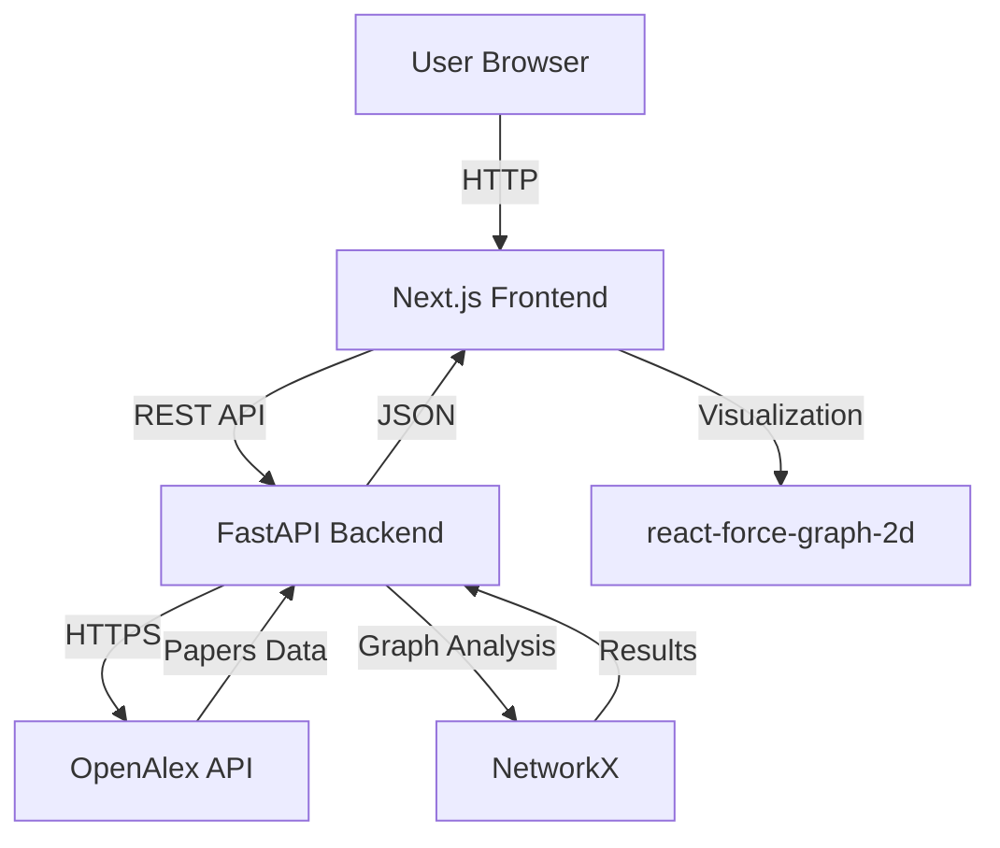
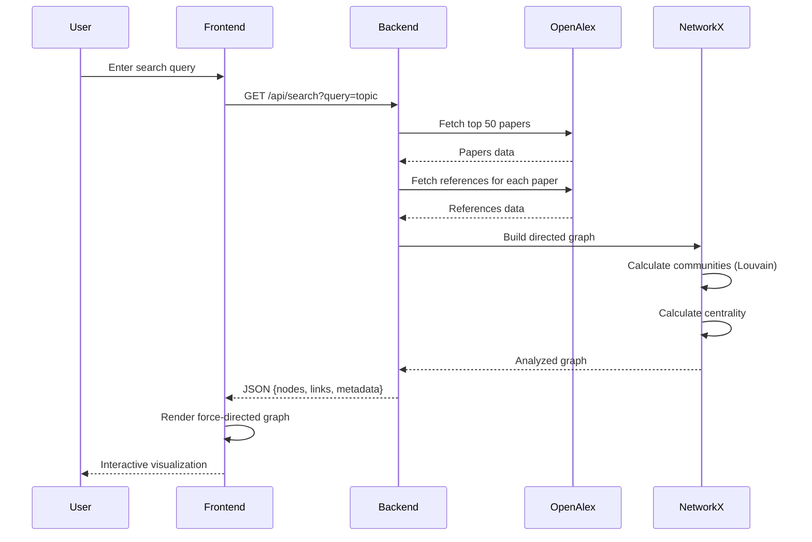
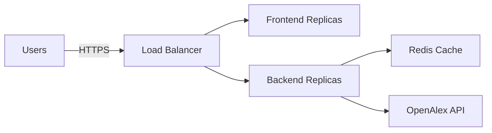

# Academic Paper Analysis Tool - Architecture

## System Overview



---

## Architecture Layers

### 1. Frontend Layer (Next.js)

**Technology**:
- Next.js 14+ (App Router)
- React 18+
- TypeScript 5.0+
- react-force-graph-2d

**Components**:
```
frontend/src/
├── app/
│   ├── page.tsx           # Main page
│   ├── layout.tsx         # Root layout
│   └── globals.css        # Global styles (Rams)
├── components/
│   ├── SearchBar.tsx      # Search input (Rams style)
│   ├── ForceGraph.tsx     # Force-directed graph
│   ├── NodeDetails.tsx    # Paper details panel
│   └── Loading.tsx        # Loading state
├── hooks/
│   └── usePaperSearch.ts  # API fetching hook
└── types/
    └── graph.ts           # TypeScript definitions
```

**Design Philosophy**: Dieter Rams' 10 Principles
- Minimalist, industrial aesthetic
- Colors: White/Grey/Orange (#FF4400)
- No gradients, no shadows
- Clean grid layout

---

### 2. Backend Layer (FastAPI)

**Technology**:
- FastAPI 0.100+
- Python 3.10+
- httpx (async HTTP client)
- NetworkX 3.0+

**Modules**:
```
backend/app/
├── main.py              # FastAPI app entry
├── api/
│   ├── search.py        # /search endpoint
│   └── health.py        # /health endpoint
├── services/
│   ├── openalex_client.py    # OpenAlex API wrapper
│   ├── citation_network.py   # Graph builder
│   └── graph_analyzer.py     # NetworkX analysis
├── models/
│   ├── paper.py         # Pydantic models
│   └── graph.py         # Graph data models
└── utils/
    ├── cache.py         # Caching layer
    └── logger.py        # Logging config
```

**Key Services**:

#### OpenAlex Client
```python
class OpenAlexClient:
    async def fetch_papers(query: str, limit: int) -> List[Paper]
    async def fetch_references(paper_id: str) -> List[Reference]
```

#### Citation Network Builder
```python
class CitationNetworkBuilder:
    def build_network(papers: List[Paper], references: List[Reference]) -> Graph
    def calculate_communities(graph: Graph) -> Graph
```

---

### 3. Data Layer (External)

**OpenAlex API**:
- Endpoint: `https://api.openalex.org/works`
- Rate Limit: Polite pool (recommended < 10 req/s)
- Authentication: None required

**Data Models**:
```python
class Paper:
    id: str                    # OpenAlex Work ID
    title: str
    cited_by_count: int
    publication_year: int
    authors: List[str]
    references: List[str]      # IDs of cited papers

class CitationGraph:
    nodes: List[Node]
    links: List[Link]
    metadata: GraphMetadata
```

---

## Data Flow

### Search and Visualization Flow



---

## Graph Analysis Pipeline

### 1. Data Collection
```python
papers = await openalex_client.fetch_papers(query, limit=50)
references = await openalex_client.fetch_references(papers)
```

### 2. Graph Construction
```python
G = nx.DiGraph()
for paper in papers:
    G.add_node(paper.id, **paper.dict())
for ref in references:
    G.add_edge(ref.source, ref.target)
```

### 3. Community Detection
```python
from networkx.algorithms import community

communities = community.louvain_communities(G.to_undirected())
for idx, comm in enumerate(communities):
    for node in comm:
        G.nodes[node]['community'] = idx
```

### 4. Centrality Calculation
```python
centrality = nx.betweenness_centrality(G)
for node, score in centrality.items():
    G.nodes[node]['centrality'] = score
```

### 5. Export for Visualization
```python
return {
    "nodes": [{"id": n, **G.nodes[n]} for n in G.nodes()],
    "links": [{"source": u, "target": v} for u, v in G.edges()]
}
```

---

## Deployment Architecture

### Development
```yaml
version: '3.8'
services:
  backend:
    build: ./backend
    ports:
      - "8000:8000"
    environment:
      - OPENALEX_EMAIL=your@email.com
    volumes:
      - ./backend:/app

  frontend:
    build: ./frontend
    ports:
      - "3000:3000"
    depends_on:
      - backend
    environment:
      - NEXT_PUBLIC_API_URL=http://backend:8000
```

### Production (Future)


---

## Performance Considerations

### Backend Optimization
1. **Caching**:
   - Cache OpenAlex responses (TTL: 1 hour)
   - Cache computed graphs (TTL: 30 minutes)

2. **Async Operations**:
   - Parallel fetching of references
   - Non-blocking I/O with httpx

3. **Graph Computation**:
   - Limit graph size (max 100 nodes for performance)
   - Pre-compute layouts server-side (future)

### Frontend Optimization
1. **WebGL Rendering**:
   - Use ForceGraph2D with WebGL backend
   - Handle 1000+ nodes smoothly

2. **State Management**:
   - Minimal re-renders
   - Memoization for expensive computations

3. **Code Splitting**:
   - Lazy load ForceGraph component
   - Dynamic imports for heavy libraries

---

## Security Considerations

### Backend
- ✅ Input validation (FastAPI Pydantic models)
- ✅ CORS configuration (whitelist frontend origin)
- ✅ Rate limiting (future: Redis-based)
- ✅ No sensitive data in logs

### Frontend
- ✅ XSS protection (React auto-escaping)
- ✅ HTTPS only (production)
- ✅ Environment variables for API URLs

---

## Monitoring and Logging

### Backend Logging
```python
import logging

logger = logging.getLogger("app")
logger.info(f"Fetching papers for query: {query}")
logger.error(f"Failed to fetch papers: {error}")
```

### Metrics to Track
- Request latency (p50, p95, p99)
- OpenAlex API errors
- Graph computation time
- Frontend load time

---

## Future Enhancements

### Phase 2
- [ ] User authentication
- [ ] Saved searches
- [ ] Export graphs (GEXF, GraphML)
- [ ] Advanced filters (date range, citation count)

### Phase 3
- [ ] Real-time collaboration
- [ ] Custom graph algorithms
- [ ] Machine learning insights
- [ ] Mobile app

---

## Technology Rationale

### Why FastAPI?
- Modern, fast, async-first
- Automatic API documentation
- Type hints and validation

### Why NetworkX?
- Comprehensive graph algorithms
- Easy integration with Python
- Battle-tested for academic use

### Why Next.js?
- Server-side rendering
- Excellent developer experience
- Built-in optimization

### Why react-force-graph-2d?
- WebGL-powered performance
- Simple API
- Active community

---

## References
- [FastAPI Documentation](https://fastapi.tiangolo.com/)
- [NetworkX Documentation](https://networkx.org/documentation/stable/)
- [OpenAlex API](https://docs.openalex.org/)
- [Next.js Documentation](https://nextjs.org/docs)
- [Dieter Rams Design Principles](https://www.vitsoe.com/us/about/good-design)
